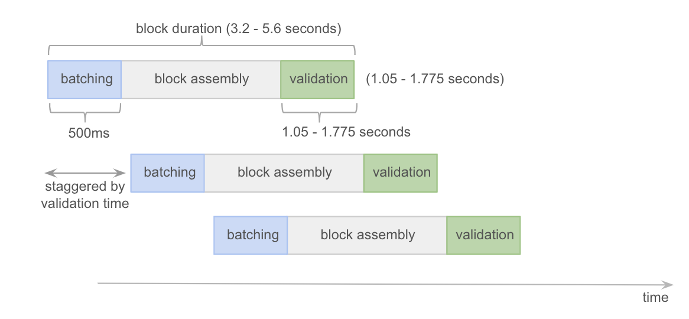
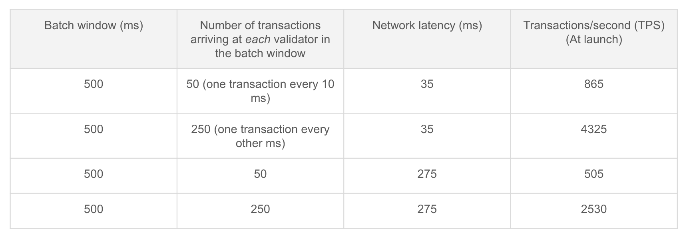
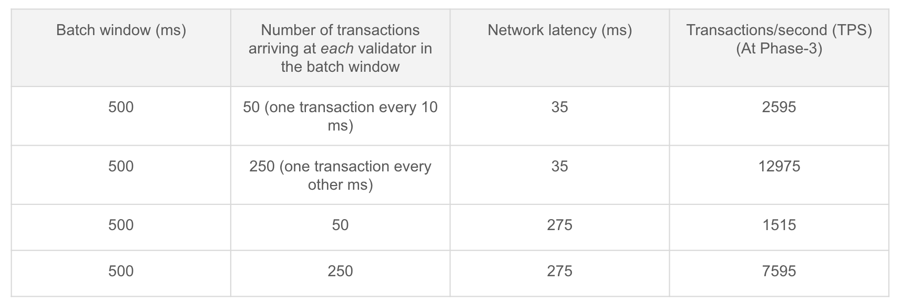
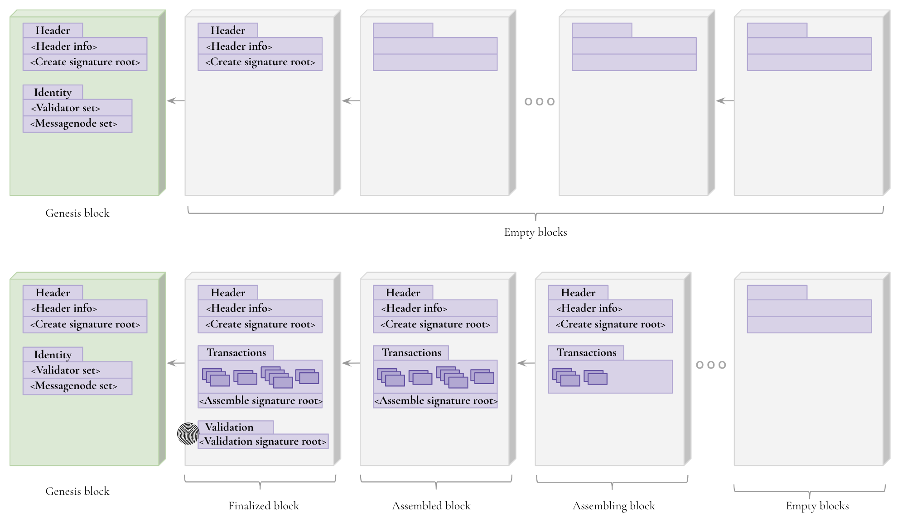

# Storecoin Block Structure

## Introduction

This document describes the block structure for the Storecoin blockchain. Storecoin’s [BlockfinBFT](https://research.storecoin.com/BlockfinBFT) leaderless, Byzantine fault tolerant consensus algorithm uses a non traditional approach to building blocks. Instead of the traditional "*create the block in the local node privately and publish it to the blockchain*" approach, it pre-creates empty blocks at regular intervals and then fills them with transactions as they arrive. Once the transactions are assembled into the pre-created blocks, they are validated and finalized. This approach is adopted to avoid chain forks and the resulting *waste*, but more importantly, to allow for a pipelined and parallel block assembly and validation process, thus improving the overall throughput.

## Terminology

**Validator** — A node type responsible for receiving transactions from senders and validating the blocks. 

**Messagenode** — A node type responsible for assembling transactions into blocks and prepare the blocks for validation by the Validators.

**Miner** — A term used to reference Validators and Messagenodes collectively, if their individual differences don’t matter.

**Throughput** — Number of transactions finalized per second. It can also be referred to as TPS. This is not the number of transactions that each Validator receives, but the transactions included in the blocks, which are finalized by the Validators.  

**Finalization** — The process of validating the transactions included in the block. Each Validator performs the validation and signs the block with its private key. When more than ⅔ Validators sign the block, the block is said to be finalized. We also use the term, "Committed" to mean the same. Once a block is committed, the transactions included in the block are also automatically committed.

## Block assembly and validation

BlockfinBFT doesn’t produce blocks at predetermined intervals. This is because the transaction arrival at Validators is unpredictable. There may be periods of heavy traffic followed by no traffic at all. In order to minimize the transaction finalization time, the miners attempt to include them into the next available empty block as soon as possible without waiting for predetermined intervals or specific number of transactions. This means:

* there will not be any empty blocks finalized

* the number of transactions and hence the block size vary from block to block

* block finalization interval is not constant and varies depending on the time it takes for all validators to validate the transactions in the block.

While block finalization takes finite time to complete, BlockfinBFT’s pipelined block validation process allows parallelization of independent steps. So, while a block is being finalized, future blocks may be getting assembled at the same time. So, the effective rate of block finalization is higher than the rate at which individual blocks are finalized as shown in fig. 1.



Fig. 1 — BlockfinBFT’s pipelined block assembly and validation process

The block assembly and validation process works as follows:

1. Validators batch incoming transactions for efficiency. A default batch interval of 500ms is used to collect all the transactions received in that duration. 

2. Validators send their transaction batches to Messagenodes. Each validator connects to a subset of Messagenodes to speed up sending transaction batches and eventual gossiping. Each transaction batch received from a Validator becomes a candidate to include in the next empty block.

3. Messagenodes run the consensus algorithm to agree on the transaction batches to include in the next empty block.

4. Messagenodes notify the Validators when the block is ready for validation. This step is called block assembly.

5. Validators validate the transactions in the assembled block and sign the block.

6. When at least (⅔ +1) Validators sign the block, the block is finalized.

Since BlockfinBFT *assembles* transactions into pre-created empty blocks, all stakeholders — transaction senders, Validators, Messagenodes, anyone querying the blockchain state — know exactly which block is being assembled, which block is currently being validated, which block is finalized, and so on. This public visibility into the block assembly and validation process sets BlockfinBFT apart from other consensus algorithms where the new block won’t be visible to the network until the winning miner broadcasts the new block to the network and the nodes accept that block. This property is critical to avoiding possible chain forks and the expensive checks to necessary select the longest chain.

Fig. 2 illustrates theoretical throughput of Storecoin blockchain at launch scenario. For this illustration, we assumed the participation of 22 Validators and 8 Messagenodes. As fig. 2 illustrates, the throughput depends on network latency and the rate at which transactions arrive at Validators. We call this adaptive throughput. With a batch interval of 500ms and a network latency of 35ms, we can achieve a throughput of 4,325, if a transaction arrives every other ms at each of the validators. If on the other hand, transactions arrive every 10ms, the throughput drops to 865. 



Fig. 2 — An illustration of BlockfinBFT’s adaptive throughput 

Unlike traditional consensus algorithms, BlockfinBFT’s adaptive throughput is also influenced by the number of Validators receiving the transactions. Assuming a future phase with 66 Validators and 24 Messagenodes, the theoretical throughput will be as shown in fig. 3. Of course, the throughput peaks at certain number of Validators before it falls off due to overwhelmed block validation process. 



Fig. 3 — Effect of number of Validators on adaptive throughput

## Serialization

We use [Protobuf](https://developers.google.com/protocol-buffers/) for data serialization. The listings in this document use JSON notation for simplicity. The data model discussed later in this document contains Protobuf schema. 

## Immutability

Because of the way BlockfinBFT builds the blockchain, the traditional notion of immutability doesn’t apply for Storecoin blockchain. Traditionally, a block is immutable once it is accepted into the blockchain. In BlockfinBFT, block creation, assembly, and validation are 3 separate steps, so a block as a whole is not immutable in one step. We are not changing the definition of immutability or interpreting it differently, but immutability applies to different sections of the block as it goes through the above steps. After finalization, the block attains immutability comparable to traditional blocks. Fig. 4 illustrates different stages in which the blocks are transformed.

 



Fig. 4 — Different stages of block transformation

At launch, the genesis block is created with the genesis information. Since BlockfinBFT is a PoS blockchain, the identities of first set of miners is captured in the genesis block. Each miner has the following publicly identifiable information.

1. Public key — The public key of the miner, so the signatures produced by the miner can be verified with it.

2. Account — Miner’s address which is funded with the required stake.

3. Verified credential — A key to miner’s verified credential on Storecoin Github project. The verified credential is generated by a third party KYC provider, who verified the identity of the miner.

The identities of both Validators and Messagenodes are registered in the genesis block. Storecoin blockchain also uses backup Validators and Messagenodes, who will fill-in for primary Validators and Messagenodes in the event they were not able to maintain the necessary uptime or act maliciously and removed from their responsibilities.

```
{

#Validator set. Each validator is keyed by the public key of the validator.

"validators": {

"<public key>": {

"account": “<Address of the funded account>”,

"verified_credential": “Verified credential key on Github>”

},

. . .

},

#Messagenode set. The data is organized similar to the validator set.

"messagenodes": {

"<public key>": {

"account": “<Address of the funded account>”,

"verified_credential": “Verified credential key on Github>”

},

. . .

},

#Backup Validator set. 

"backup_validators": {

"<public key>": {

"account": “<Address of the funded account>”,

"verified_credential": “Verified credential key on Github>”

},

. . .

},

#Backup Messagenode set. 

"backup_messagenodes": {

"<public key>": {

"account": “<Address of the funded account>”,

"verified_credential": “Verified credential key on Github>”

},

. . .

}

}
```

Listing 1 — Genesis information

The block header contains the following information. Since the block takes its shape in multiple steps, the relevant header information is also broken respectively into multiple headers.

```
#The initial block header is created with the block itself.

"block_header": {

	"type": <Block type — GENESIS|TRANSACTION|IDENTITY>,

	# GENESIS — Genesis block.

	# TRANSACTION — Normal block containing transactions.

	# IDENTITY — Identity block. Similar to genesis block, but used to 

	# contain the identities of new miners, when they join the network.

"version": <Block version number>, 

"nonce": <An increasing integer used as block number>,

"prev_block_hash": “<Block hash of the previous block>”,

"timestamp": <Time of block creation>,

"create_signature_root": “<Merkle root of Messagenode signatures>”

}
```

Listing 2 — Block header

The "block_header" is added at the time the empty blocks are created. In order to ensure that the block assembly continues as the transactions arrive, a predefined number of empty blocks are created and added to the blockchain. As these empty blocks are eventually finalized, more empty blocks are added to the blockchain, continuing from the last block in the chain. An environment variable, EMPTY_BLOCK_LEN is defined, which states how many new empty blocks are added to the blockchain. Messagenodes are responsible for managing the blockchain and hence they create empty blocks whenever they are needed. 

Every new block created must be signed by the Messagenodes participating in creating the new blocks. More than ⅔ Messagenodes’ signatures are required for the new blocks to be legitimate and recognized by the Validators. The Merkle root of the signatures is added to the "block_header" so anyone can validate the legitimacy of the empty blocks. 

When the Messagenodes agree on the set of transaction batches for the next empty block, they again sign the block, this time indicating the set of transaction batches included in the block. The Messagenodes participating in the assembly stage may be different from the Messagenodes who created the empty blocks. This can happen if between these two events, some Messagenodes dropped out and new Messagenodes joined the network. Listing 3 shows the transaction header.

```
"transaction_header": {

"prev_transaction_hash": “<Transaction hash of the previous block>”,

"timestamp": <Time of block assembly>,

"transaction_root": “<Merkle root of the transaction batches in the

 block>",

"assemble_signature_root": “<Merkle root of signatures of Messagenodes,

  who assembled the block>"

}

"transaction_batches": [

	"<transaction_batch_hash>",

	. . .

]
```

Listing 3 — Transaction header

The creation of the "transaction_header" with “assemble_signature_root” included signals that the block is ready for validation. All the Messagenodes notify the Validators they are connected to that the block is ready for validation.

At this point, the block also contains the list of transaction batches included in the block. The transaction batches are sorted by their hashes. The Merkle root of the transaction batches is included in the "transaction_header". Every Messagenode signs the “transaction_root”.

The final step of the block transformation is block validation and it is done by the Validators. Every Validator validates the transactions in the transaction batches included in the block. Some transactions may fail validation because of double-spend and other reasons. The block is finalized even if contains failed transactions, but the failed transactions are listed by the Validators when they sign the block. Listing 4 shows the signature of a single Validator.

```
"<Validator public key>": {

	"signature": “<Signature of the validator>”,

	# Optionally, list the failed transactions.

	"failed_transactions": [

	"<transaction hash>",

	. . .

	]

}
```

Listing 4 — Validator signature

The hashes of failed transactions, if any, are included in Validator’s signature object. Validator’s signature is produced on the combination of "transaction_root" and the hash of the “failed_transactions” list.

Each Validator writes its signature to the block. A block is finalized when the following conditions are met.

1. At least ⅔ + 1 Validators sign the block.

2. "failed_transactions" list, if any, by all signed Validators are identical. This means, all Validators made the same decisions.

When these conditions met, a validation header is added to the block as shown in listing 5.

```
"valdiation_header": {

"prev_validation_hash": “<Validation hash of the previous block>”,

"validation_signature_root": “<Merkle root of signatures of Validators,

  who validated the block>",

		"failed_transactions": [

	"<transaction hash>",

	. . .

	]

}
```

Listing 5 — Validation header

The "valdiation_header" contains “failed_transactions” if it is non-empty, so anyone can identify failed transactions. Even though the block is finalized, these specific transactions are declared failed. 

In addition to the standard fields described above, the block contains hashes to audit log records at various stages of block assembly and validation. The audit logs help trace the activities performed by various miners at different stages of block assembly and validation process. For brevity, such details are omitted from this document.

The block itself contains hashes and Merkle roots of associated data in order to keep the block size limited. The associated data can be queried using respective hashes or Merkle roots as keys.

As fig. 4 illustrates, the empty blocks may be in various stages of block assembly and validation process. The only restriction is that a block cannot be validated (and hence finalized) without finalizing its previous block. In other words, the validation step is serialized at Validators. Since transaction batching and block assembly takes majority of the time, multiple blocks can be assembled and readied for validation. 

## Database schema

[BlockfinBFT database schema](schema.md)

## Fully formed sample block 

TODO

