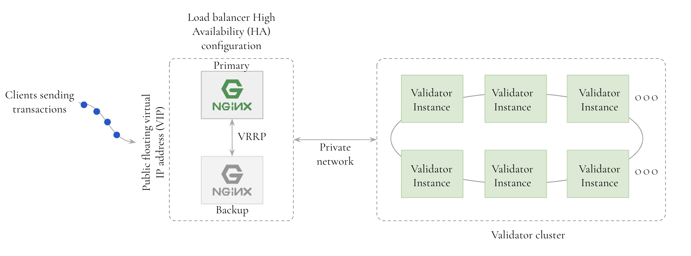
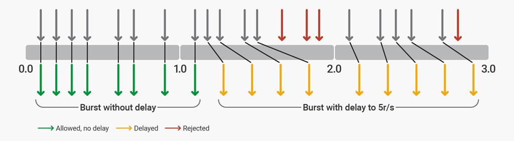
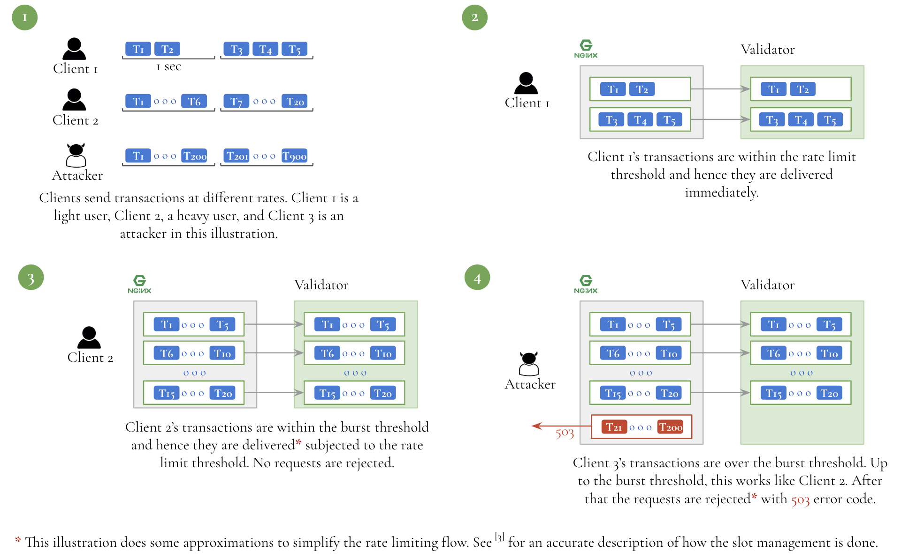
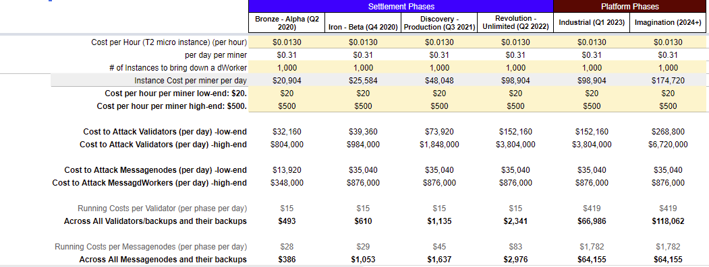

# Rate Limiting and DDoS Mitigation

## Introduction

This document discusses rate limiting and DDoS protection approaches used to protect the nodes in the Storecoin blockchain. The Storecoin blockchain consists of a two-tier network of Validators and Messagenodes. Each of these node types is vulnerable to DDoS, so they both implement mechanisms to minimize this type of attack. Of the two node types, Validators are more likely be the targets for DDoS as they are client-facing. Messagenodes are not directly accessible to clients, so any DDoS on them would potentially be originating from the Validators. This document discusses specific approaches implemented to minimize DDoS attacks.

## Spam vs DDoS

In this document we differentiate between spam and DDoS in order to design the right approaches to handle each type of these attacks. 

A spam is an attempt to overwhelm the target system with a large number of requests, but the requests themselves are legitimate. In the blockchain environment, a spam consists of sending a large number of micro transactions. The transactions sent by the adversaries are legitimate, but each transaction consists of transferring the lowest denomination permitted in the network. For example, an attacker can send a large number of transactions to Bitcoin network, where each transaction sends 547 Satoshis, the dust limit [6] for Bitcoin. So, at a cost of 1 Bitcoin, the adversary can send 182,815 transactions. The daily average of Bitcoin network is 358,706 transactions, so it costs about 2 Bitcoins to spam the network for a day. The adversary may not care if the miners accept these transactions, but since the transactions are *valid*, full nodes relay them and they will be waiting, perhaps forever, to be included in the next mined block. In this type of attack, the cost of attack is the cost of setting up the wallets to send the dust amounts and the number of tokens the attacker is willing to lose. 

A DDoS, on the other hand, may not involve sending legitimate requests to the target system. In this attack, the attacker sends a large number of requests, like in the spam attack, but the requests are undecipherable messages. In Bitcoin, for example, full nodes don’t relay malformed requests, but they individually need to deal with these requests anyways. The full nodes eventually blacklist the IP addresses sending invalid transactions, but the attacker can devise the attack from a large pool of IP addresses for the continuous attack. If the attacker targets a large number of full nodes, they could go down potentially because many full nodes are not enterprise grade. In this type of attack, the cost of the attack is the cost of setting up or renting the infrastructure to send large volumes of the data to the target system.

Spam is a special case of DDoS attack. We make this differentiation in order to model the cost of attack on Storecoin network.

## DDoS attacks cannot be *prevented* 

There is no provable way to *prevent* DDoS, but its effect can be *minimized* if the system is designed to handle such attacks. The purpose of such an attack is to take the system down and bring it to its knees so that the system is virtually unavailable. So, our goal is to ensure that both Validators and Messagenodes can function, even if at diminished capacities, during the attack. DDoS attacks are expensive and time consuming. They require quite a bit of planning. The attacker’s goal is to bring the system down as quickly as possible. So, if the system is resilient for a longer duration and can never be taken down, the attackers retract because of the cost associated with continuous attacks.  Multi-day DDoS attacks are possible [1], but they are uncommon. If such attacks were launched on Storecoin network, the worst that should happen is that the Validators and Messagenodes spend most of their time rejecting the spam, potentially resulting in lower throughput as very few legitimate transactions can get through in the face of the attack.

P2p networks are generally more resilient to DDoS attacks than centralized or cloud services, but individual nodes in the p2p network can be targeted with this type of attack. In order for the attack to be successful, all the nodes in the network must be attacked, which increases the cost of the attack as more nodes are added to the network. In the Validator network, individual Validators can be targeted with DDoS attack. So, to fully compromise the entire Validator network, all the Validators must be individually attacked and compromised. So, individual Validators must be protected from DDoS attacks in order to protect the entire Validator network.

## Fallacy of transaction fees preventing spam and DDoS 

There is a myth that transaction fees are instituted to prevent DDoS and spam. As discussed in the Spam vs DDoS section, spamming a network costs very little. DDoS attack doesn’t even to have to send legitimate transactions, so transaction fees don’t deter DDoS attacks. In the attack described in [7], the spammers in fact paid highest transaction fees possible in order to delay transactions that include smaller fees.

  **BTC Spam attack. 200,000 unconfirmed transactions halts bitcoin**

. . . where they are paying the highest fees to halt the network. Bitcoin developers delivered but we're still waiting on miners and spammers holding the chain hostage. Not paying highest fee takes transactions 10+ hours to get confirmed.

An attack on Ethereum in 2018 [8] also demonstrates that transaction fees didn’t deter the spammer. 

It’s a botted ring wallet system with nearly 150,000 to 200,000 ethereum in it. The bots translate random addresses to other random addresses and random amounts of eth to make them difficult to spot on block history. I don’t have the tools." The spam suspicions are high because very rarely network gas usage go above 20%, even for the best-used apps. If it’s a spam attack, the cost might be around $20,000, considering the amount of ETH sent and received — 150,000 ETH.

A google search yields a number of spam attacks on multiple blockchains where the networks are overwhelmed with legitimate transactions. We therefore conclude that transaction fees don’t deter spam or DDoS attacks. They have their use — as a form of payment to the miners for including the transactions into the mined block — but not as spam or DDoS fighters.

We can also observe that a large number of valid transactions arriving in a short period of time also look like spam or DDoS traffic. If the incoming rate of transactions is beyond what the nodes are designed for, they will be overwhelmed by the traffic and hence they react to valid transactions as if they were DDoS traffic. In other words, at high traffic volume, valid traffic has the same effect on the nodes as the DDoS traffic. 

So, we can conclude the following:

1. At high traffic volume, valid transactions have the same effect on the receiving nodes as the DDoS traffic. We can say that this is *legal* DDoS.

2. Transaction fees won’t act as deterrent because a determined attacker can send junk traffic to overwhelm the receiving nodes.

3. The receiving nodes must protect themselves from the traffic volume that is at much higher rate than they are designed for. Irrespective of how big the nodes are in terms of memory, CPU, and storage, they can always be overwhelmed, so a good design attempts to protect the nodes when the incoming traffic is beyond the capacity of the nodes.

### Complexities arising from Storecoin zero-fee transactions

Transactions incur no transaction fees in Storecoin blockchain. With zero-fee transactions, there is a potential for a large number of micro transactions arriving at all Validators, thus overwhelming the Validator network. Storecoin minimizes this impact by specifying a *dust limit* similar to the Bitcoin network. In other words, while a transaction with 1 Edison, STORE’s smallest unit, is legitimate, the network rejects such transactions and wallet apps won’t allow creating transactions that are smaller than the specified dust limit. Note that the dust limit only minimizes the impact as we have seen in the case of Bitcoin example earlier, but it helps the system with differentiating legitimate traffic vs potentially spammy traffic. In other words, if there is a large number of transactions arriving at Validators in a short period of time, the nodes can treat them as legitimate if the transaction values are higher than the dust limit and as spam transactions, if the transaction values are lower.

## Strategies for mitigating DDoS attacks

Since DDoS attacks can never be fully avoided, the next best thing to do is to mitigate when the attack takes place. There are 3 strategies to mitigate this type of attack. The rest of this document treats DDoS and spam attacks similarly from mitigation point of view.

1. **Rate limiting** — Enforce rate limiting on incoming traffic. Individual nodes can have their own rate limiting factor based on their respective capacities. The rate limiting can be dynamic and adaptive to create back pressure on the incoming traffic. 

2. **Ingress queue management** — Implement queue management at the ingress of the nodes, so the nodes don’t run out of memory and crash eventually. Various leaky bucket algorithms [2] can be used to ensure that the queue threshold is not breached, thus ensuring the safety of the nodes. Like rate limiting, this can be dynamic and adaptive.

3. **Third party DDoS protection** — Use third party DDoS protection services like [CloudFlare](https://www.cloudflare.com/lp/ddos-x/?_bt=308976278796&_bk=%2Bcloudflare%20%2Bddos&_bm=b&_bn=g&_bg=58800294943&gclid=EAIaIQobChMI9JLpwbia4AIVVxePCh0XRwwLEAAYASAAEgLdavD_BwE) to fight DDoS. The incoming traffic is first routed to these services, which detect and drop DDoS packets, thus protecting the services behind them.

Storecoin employs strategies 1 and 2 described above at launch phase. At full capacity in subsequent phases, option 3 may also be used in addition to options 1 and 2.

### Rate limiting

Fig. 1 illustrates the deployment for Validators. The same design applies to Messagenodes as well, so they are not discussed separately in this document.

 



Fig. 1 — Validator node setup with Nginx load balancer in HA configuration

The Validator cluster consists of multiple Validator instances. Each instance is stateless and an incoming transaction can be routed to any of the instances. Together, these instances meet the capacity requirements for the Validator. These instances can be elastically expanded depending on the capacity need. 

The Validator cluster is fronted by Nginx servers in high availability configuration, which act as both load balancers and rate limiters [3]. 

### Rate limiting strategy

The validators batch incoming transactions before they send them to the Messagenodes to improve communication efficiency and simplify block assembly process at Messagenodes. The batch duration defaults to 500ms. The rate limiting is designed such that at launch phase, the number of transactions will be throttled artificially lower to aid smooth launch. The rate will be increased gradually over time as the network becomes stable. This strategy also helps with the control on hardware requirements at launch and ensures that the Validators are equipped with necessary hardware before supporting the promised throughput. 

The following rate limiting strategy is used. See [3] for more details.

1. Rate limit requests originating from remote IP address to certain request per second (rps.) At launch this will be **5** (approximately 2 requests per batch period) and will be increased over time to meet the promised throughput. Note that this rate limit is per Validator node. 5 transactions per second is not the throughput of the network.

2. Allow for bursty traffic. The transactions seldom arrive uniformly at Validators, so if a burst of transactions arrive at a Validator, allow for processing them to a limit before rejecting the requests with a 503, "Service Temporarily Unavailable". A burst of **20** transactions is accepted at a time before rejecting with 503. The transactions in the bursts are processed immediately one after the other, without any delay.

3. A two-stage rate limiting is employed where the Validators will be able to process the typical load they are designed to handle and then allow for a burst with certain limit before starting rejecting incoming transactions.

The following example illustrates the above strategies in action.

```
limit_req_zone $binary_remote_addr zone=ip:10m **rate=5r/s**;

server {

    listen 80;

    location / {

        limit_req zone=ip **burst=20 delay=10**;

        . . .

    }

}
```

The request rate is limited to 5 rps. We allow for twice this limit for immediate processing. a A burst can never contain more than 20 requests. The first 10 requests in the burst are processed immediately without any delay. The next 10 requests in the burst are processed with certain delay, but still honoring 5 rps. If the burst has more than 20 requests, they are rejected with 503. The following diagram illustrates how the two-stage rate limiting works. This illustration from  [3] assumes **burst=12 delay=8.**



Fig. 2 — Two-stage rate limiting with Nginx. Image courtesy [3].

With two-stage rate limiting, any DDoS attempt that violates the above rules will be rejected with a 503. Note that the rejected requests will not reach Validators, thus protecting them from crashing or slowing down. The two-stage rate limiting allows for occasional bursty traffic, so transactions won’t be rejected until the specified thresholds are reached.

### Whitelisted transaction originators

Some transaction originators can be merchants or developers and not individual users. The above rate limiting severely limits their ability to send more transactions to meet their specific requirements. Nginx allows whitelisting remote addresses, who are not constrained by rate limiting. We employ two strategies.

1. For preapproved large clients and partners, we remove the theoretical rate limiting restrictions. However, we still need to protect the Validators from crashing or slowing down, so there is a maximum threshold after which the requests will be rejected. The maximum threshold can be:

    1. **rate=500r/s**;

    2. **burst=2000 delay=750**;

2. For preapproved second tier clients and partners, the limit is higher than normal clients, but lower than first tier clients. For example:

    3. **rate=50r/s**;

    4. **burst=200 delay=75**;

The above numbers are for illustration purposes only. The exact thresholds are determined based on the throughput requirements, capacities of Validators, and the promised quality-of-service to partners. These thresholds will be slightly different for Messagenodes as they receive their requests mostly from Validators, but the exact configuration is used to mitigate DDoS for Messagenodes also. Fig. 3 illustrates how rate limiting works for various request rates. Notice how Nginx servers protect validators from excessive request loads. 



Fig. 3 — Rate limiting for various request rates.

## Nginx DDoS protection

Nginx also protects its clients from DDoS traffic. The rate limiting discussed above is part of this protection. In addition, it provides the following instruments [4] to fight DDoS.

1. Limiting the number of connections originating from a remote address at any time. This prevents an attacker from creating multiple connections to flood the network with requests. For normal clients, only one connection is allowed per remote address. Tier 1 partners may create 10 connections and tier 2 partners can create 2 connections per remote address.

2. Closing slow connections. If the clients hold on to the connections for too long and write too slowly, the connection is closed to prevent misuse for DDoS.

3. Blacklisting and whitelisting remote addresses. This is an ongoing process to prevent requests coming from known attackers.

4. Blocking requests with missing/altered headers.

5. Protection against range attacks. See [5] for more details.

## Cost of spam and DDoS attacks

The spam and DDoS attacks cost differently. In this section we discuss the cost of attacking Storecoin network with spam or DDoS.

### Cost of spam attack

With spam, legitimate, but micro transactions are sent to Storecoin network. The cost of attack consists of two parts:

1. The cost of creating a large number of addresses to receive STORE. Since there is no cost to creating addresses, this cost is virtually free.

2. The cost of STORE to send a large number of transactions. 

For the sake of modeling, we can ignore the cost of creating addresses. So:

Cost of spam attack = number of STORE required to send a large volume of transactions.

Let’s assume the dust limit for Storecoin transaction is 5,000 Edisons. The transaction value cannot be lower than this limit. If a transaction of lower value is sent, the transaction is rejected. We classify such transactions as DDoS as those transactions are deemed invalid. With each transaction for 5,000 Edisons, 20,000 transactions can be created for every STORE. So, the cost of attack is very low, but this is not surprising based on the example we discussed earlier with Bitcoin.

### Cost of DDoS attack

There is no easy way to model the cost of attack as there are hundreds of ways to mount the attack — from compromised machines with malware to actually spending a large sum of money to mount the attack. For IP address, with AWS, you can have private elastic IP addresses. The cost is the cost of running individual instances. T2 micro instances are $0.013/hour, so for example, if you launch 1,000 instances it will cost $13/hour. For a successful attack on 231 validators for example, each validator must at least be bombarded with 1,000 clients because of rate limiting and hence 231 x 1,000 x 0.013 = $3,030 per hour.  There is very little information on how exactly these attacks are mounted and the associated cost. This suggests that there are alternative/illegal approaches to this attack, which can be launched cheaply or the cost is no object in that context.



Fig. 4 — Cost of DDoS attack in different phases of Storecoin blockchain						

## Summary

Nginx serves not only as high availability load balancer, but also as DDoS mitigator. DDoS mitigation comes in a two-pronged approach.

1. Request rate limiting strategies.

2. Specific methods to block, limit unwanted traffic.

## References

1. https://www.techrepublic.com/article/major-ddos-attack-lasts-297-hours-as-botnets-bombard-businesses/.

2. https://en.wikipedia.org/wiki/Leaky_bucket.

3. https://www.nginx.com/blog/rate-limiting-nginx/.

4. https://www.nginx.com/blog/mitigating-ddos-attacks-with-nginx-and-nginx-plus/.

5. https://www.nginx.com/blog/nginx-protect-cve-2015-1635/?_ga=2.95087327.250168581.1549021381-1900120403.1549021381.

6. https://bitcoin.stackexchange.com/questions/17830/whats-the-minimum-transaction-with-bitcoin.

7. https://steemit.com/cryptocurrency/@superfreek/btc-spam-attack-200-000-unconfirmed-transactions-halts-bitcoin.

8. https://bcfocus.com/news/ethereum-network-might-be-under-spam-attack/20484/.

