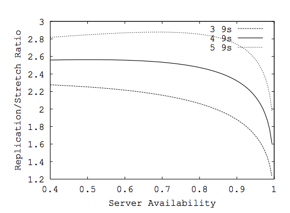
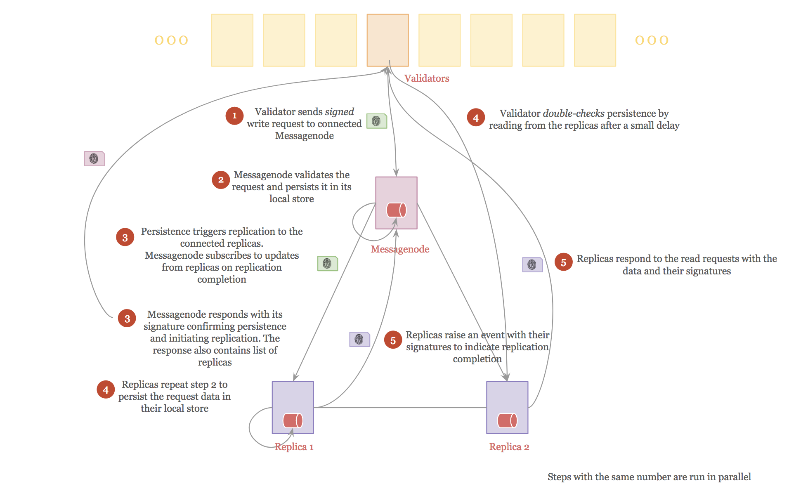

# Auditability in BlockFin Consensus Protocol 

## Introduction

Blocks in the blockchain are produced by potentially untrustworthy validator nodes who participate in the consensus process. So, we cannot automatically trust that a validator node actually does what it says it does. BlockFin in particular, consists of a two-tier P2P network consisting of validator nodes and Messagenodes. The Messagenodes are responsible for providing the storage service for the overarching validator nodes. So, trust is even harder to come by. The Messagenodes can simply reject the requests to persist the block data or return unverified or compromised data to validators. Validators can also pretend like not receiving the data from Messagenodes. This document addresses these concerns and makes lying a non-option.

## Replication vs Erasure coding

High availability of storage in a P2P distributed environment comes down to 2 choices.

1. **Replication** — This involves creating multiple copies of data across different nodes for high availability. For example, creating 3 copies of the data allows for the failure of 2 nodes at any given time without sacrificing the availability (but perhaps at the expense of reduced capacity.)

2. **Erasure coding** — In this approach, the data is split into **_m_** fragments and recoded into **_n_** new fragments, such that **_n > m_**. Any **_m_** of **_n _**fragments are sufficient to recreate the original data. The **_n_** fragments are spread across different nodes for high availability.

In an environment where the connectivity is unreliable and node availability is low, erasure coding is a preferred approach for its efficiency in storage for the same availability. See the comparison of the two approaches [here.](https://www.cs.cornell.edu/people/egs/iptpsarchive/iptps05.cs.cornell.edu/PDFs/CameraReady_223.pdf) Specifically, notice in fig. 1 below that even at low availability of 0.4 (40%) a replication ratio (**_n/m_**) of around 2.8 is sufficient to provide five 9s high availability. The ratio decreases to about 2 as the node reliability increases. 

Fig. 1 — Replication ratio vs server availability with erasure coding

While erasure coding scheme optimizes storage and provides high availability, it is not particularly efficient. Every single request to fetch the data needs to retrieve at least **_m_** fragments from the participating nodes. This results in unnecessary communication overhead among the nodes. There is also a fragmenting and combining process overhead while writing and reading the data from the nodes. Finally, this scheme doesn’t help with improved read performance.

Replication is simpler of the two approaches. While the storage cost is provably higher, the read and write operations are simple. There is no runtime overhead associated with both the reads and the writes. Finally, all the replicas can be used for the read operation, thus significantly improving the read performance. 

This document assumes replication as the high availability scheme for BlockFin for rest of this document.

## Assumptions

The following assumptions are made about the validator nodes and Messagenodes that make up the Storecoin network.

1. All nodes, validators and Messagenodes alike, have their own {public, private} keypair. The public keys of all the nodes are well known to everyone in the network and are used to *verify* the data coming from the respective nodes. The nodes use their private keys to *sign* outgoing messages.

2. Messagenodes are a subset of validator nodes. They are connected to each other on a secure, P2P network. They accept read/write requests from validator nodes and replicate data among them.

3. A Messagenode is required to subscribe to replication messages with at least two other Messagenodes. The subscription is *bidirectional*. Any data written to one Messagenode are automatically replicated to its connected replicas. Similarly, any data written to the replicas are automatically received by the configured Messagenode.

4. Each validator node connects to one or more Messagenodes to read the block data and write into it. There is no affinity to a Messagenode. The addresses of all Messagenodes are published, so the validators are free to connect to any one or more of them.

5. Messagenodes are required to validate the authenticity of validator nodes by checking their public keys. They reject any requests coming from arbitrary nodes that are not registered as validators.

6. *Write* requests can originate only from validator nodes. *Replication* messages can originate only from Messagenodes. *Read* requests can originate only from any of the nodes.

A *write* operation, which originates from a validator node works as follows.

* The validator node takes the message **_m_** to be written and creates a hash **_H(m)_** of the message.

* The validator signs the message hash with its private key producing a signature **_S(Hm))_**.

* The validator sends the message **_m_**, the signature **_S(Hm))_**, and its public key, **_Pk_** to the connected Messagenode.

The receiving Messagenode performs the following checks before accepting the write request.

* The Messagenode verifies that the public key, **_Pk_** in the write request belongs to an authorized validator node.

* The Messagenode creates a hash **_H(m) _**of the message **_m_** in the write request. 

* The MessageNode verifies the signature as **_V(S(Hm)))_**** **using the validator’s  public key, **_Pk_** and message hash **_H(m)_**. If the verification succeeds, the write request is accepted.

* The Messagenode persists the write request data to its local storage. Since the Messagenode is connected to at least two other replicas, the write data is automatically replicated to the replicas.

* The Messagenode now signs the message hash **_H(m) _**with its private key to produce a signature **_S(Hm))_**. The signature is returned to the validator node as the *Success* response to the write request. It is a protocol violation to send the signature before the data is persisted. 

* The response also contains the list of public keys of replicas the Messagenode is connected to. The validator uses this information to verify that the data has indeed propagated over the network.

## Trust, but double-check model

Since the validators and Messagenodes have public visibility via their public keys, there is an inherent trust in the system. Any misbehavior will be caught sooner or later. But a blockchain cannot rely solely on trust, so BlockFin follows,* trust, but double-check* model. This model works as follows.

1. The validator prepares the write request as described above and it caches the request data locally with its local timestamp before sending the request to connected Messagenode. The local cache not only contains the message delivered, but who (Messagenode) it is delivered to. The write request starts with a sequence number of 0, which is used to track the number of attempts made to successfully persist the data.

2. The validator sends the request to connected Messagenode. 

3. The Messagenode verifies the write request as discussed previously and persists the data into its permanent storage. The persistence triggers the replication process to connected replicas. The Messagenode returns its signature to the validator node, indicating successful persistence of write request.

4. The Messagenode also subscribes to the update events from the connected replicas by registering a callback function on the message hash **_H(m)_**. This is used to ensure that the replicas have received the replication event and persisted the data in their respective permanent storage. 

5. The replicas receive the updates on the write request probably after certain delay depending on network conditions, their respective load, etc. Although the data to be written is exactly the same, the *write* operation is differentiated from the *replication* operation with message *types*. The replicas perform similar checks as the Messagenode on the validity of the write request and continue with the persistence. Since the persistence in the replicas is triggered by the replication operation, no further replications are triggered.

6. The replicas raise an event on the the message hash **_H(m)_** upon successful persistence. They create their signatures just like the Messagenode did and send their signatures as the event data.

7. The validator node verifies the signature of Messagenode similar to how Messagenode verified validator’s signature for the write request. This at least confirms that the Messagenode has received the write request and it bothered signing the message with its private key. But this doesn’t guarantee that the Messagenode has actually persisted the write data although it claims to have done so.

8. The Messagenode’s callback function is triggered when the write request is persisted successfully in the connected replicas. The Messagenode updates the event log indicating successful completion of the replication. If the callback function is not triggered for any reason, the Messagenode doesn’t retry to replicate the write request, but waits for the validator node to initiate the retry. But it will updates the event log indicating that the replication is incomplete.

9. The validator node now goes into *double-check* mode. This is done asynchronously so as not to block the current operation in hand. 

10. The validator node implements a small delay to ensure that the write request has successfully propagated to the replicas connected to the Messagenode. It then issues read requests to the connected replicas using the information provided by the Messagenode in its response. A successful response from one of the replicas is sufficient to confirm that the data is indeed replicated, which in turn implies that the Messagenode didn’t lie.

11. If the replicas failed to respond to the read requests, the validator node doubles its wait time and retries. 

12. If the read request succeeds in the first or second attempt, the validator node deletes the write request data from its local cache, concluding that the request is satisfied successfully by the Messagenode.

13. If the second try fails with no data, the validator node assumes that the write request has failed. It increments the request sequence number and retries the same steps described above.

14. When the Messagenode receives the same write request with a non-zero sequence number, it

    *  first verifies that it has persisted the data successfully in the previous attempt. If the data is not persisted, it will proceed with the persistence and replication

    * verifies the event log on the replication completion. If the event log has no entries for the specified write request or it indicated incomplete replication, the Messagenode verifies connectivity to the connected replicas by explicitly sending the write requests to the connected replicas. This time, it will be a synchronous call and the Messagenode doesn’t rely on the update event from the replicas

    * verifies the successful completion of replication from the replicas. The replicas return their signatures just like the Messagenode upon successful persistence

    * creates and returns its signature as described previously. In addition, the response also indicates that explicit replication is used.

The difference in this case is that the Messagenode attempts explicit replication with its connected replicas.

15. The validator node uses *double-check* mode as before and verifies that the write request is persisted by the Messagenode and is successfully replicated.

16. If the second *double-check* fails, the validator node updates the event log on the failure to persist the data with the connected Messagenode. It then connects to a different Messagenode and retries the same set of steps with the new Messagenode.

It can be observed that in the best case scenario, the number of messages will be as follows.

1. One write request from validator node to Messagenode.

2. N (say, 2) replication messages from the Messagenode to its connected replicas.

3. N events from the connected replicas indicating successful replication.

4. N read requests from validator node to the replicas.

A total of **7 messages** are exchanged when N = 2. Except for the write request, all other messages are asynchronous in nature and don’t block the application flow. 

In step 4, if the replicas don’t respond within the specified timeout, the read requests are repeated. If this happens, a total of **9 messages** are exchanged.

In the case of a retry, the number of messages will be as follows. This assumes that replication has failed previously.

5. Second write request from validator node to Messagenode.

6. N explicit replication calls from the Messagenode to its connected replicas.

7. N read requests from validator node to the replicas.

An **additional 5 messages** are exchanged among the participants. Step 5 above is synchronous and waits for step 6 to complete before returning. Step 7 is asynchronous as before. If step 7 yields no response from the replicas, an additional N read requests are sent to them, resulting in **additional 7 messages** exchanged. So, with a retry, the number of **messages will be 12 or 14**.

In the event the retry fails, the validator repeats the same steps with a different Messagenode. So, the total number of messages in the **worst case is 24 or 28**.

Notice how the number of messages get worse progressively. This is inevitable in an asynchronous, trustless environment where adversaries exist. It should also be noted that the number of messages per request is independent of number of validator nodes in the networks. In fact, in the best case scenario, there is a *single* synchronous message used to persist a *single* message. As a comparison, consider Tendermint consensus engine where every message received by a validator is replicated to every other validator node. If there are 100 nodes in the network, there will be 100 messages. The gossip protocol actually brings down this number from the number of nodes participating in the network, but it will still be orders of magnitude more than the numbers discussed above. Fig. 2 below shows the best case scenario of persisting a message. For the sake of simplicity, only the normal flow associated with persistence is discussed in this section. The exception flow, handling adversarial behaviors, etc. are discussed in the next section.

Fig. 2 — Best case scenario of persisting a message

## Adversarial behaviors

All the 3 entities (validators, Messagenodes, and replicas) can lie. One or more entities could collude to spread false information or withhold information. One or more entities could target attacks on others or blame others for their poor performance. In a trustless environment, trust is built by recording everyone’s actions, confirming the actions by independent means, and verifying that all the actions are the same, so this becomes public knowledge. We can observe the following with the persistence approach described in the previous section.

1. Validator records which Messagenode it sends the request to and what the request message is.

2. The Messagenode validates which validator the request is coming from. It responds to the validator with its signature indicating completion of the request. Along the way, it provides a proof of replicas which are tasked to replicate the message.

3. Validator independently verifies that the data is actually persisted by not reading from the Messagenode, but from the replicas.

4. Messagenode independently verifies that the data is actually replicated by subscribing to the replication completion events from replicas.

Before discussing the adversarial behaviors, we will look at common problems associated with any distributed P2P environment. We need to separate intentional violations from unavoidable ones, so the participants can take the necessary corrective measures. This separation also helps deciding whether a violation is expected or a candidate for initiating punishment. 

### Unreliable/Slow network connection

The validators and Messagenodes (replicas are actually peer Messagenodes) are connected P2P over geographically distributed regions on potentially unreliable networks. So, the connections can be broken any time or they may be very slow from time to time. Timeouts and retries are the tried and tested corrective measures in this case. The connection issues and quality are observed in the following cases. The necessary corrective measures are described for each case.

<table>
  <tr>
    <td>Stage in Persistence</td>
    <td>Problem</td>
    <td>Corrective measures</td>
  </tr>
  <tr>
    <td>1. Validator sends the write request to the Messagenode.</td>
    <td>Messagenode is not reachable. Validator doesn’t receive response within the timeout implemented.</td>
    <td>- Validator repeats the step with twice the timeout. 
- If the second attempt fails, validator connects to a different Messagenode and repeats the 2-attempt process. 
- If the request to second Messagenode fails, validator raises an alarm on connection issues.</td>
  </tr>
  <tr>
    <td>2. Same step as above.</td>
    <td>Slow network or Messagenode is busy and hence the response may be slower.</td>
    <td>Same as above. Since the second attempt implements a longer timeout, it is more likely to succeed at that time.</td>
  </tr>
  <tr>
    <td>3. Messagenode sends signed response to the validator </td>
    <td>Validator node is not reachable. There is no acknowledgement required for the receipt of the response, so the Messagenode wouldn’t know about the failure.</td>
    <td>None. The validator’s local cache is not cleared because it didn’t receive a response, so it will retry the request when it comes back online. The retry flow is same as for case 1 above.</td>
  </tr>
  <tr>
    <td>4. Messagenode wait for replication confirmation from the connected replicas.</td>
    <td>One or more of connected replicas are not reachable. Messagenode doesn’t receive confirmation from one or more of replicas.

If all replicas fail to respond, Messagenode sends a notification to the validator to indicate replication failure. If this happens, the validator is required to wait for a second notification before trying to read from replicas.</td>
    <td>- Messagenode tried to replicate manually using explicit replication mode. It doubles the timeout in this mode. Only the replicas that failed to respond are retried. One or more of explicit replication attempts may also fail.
- If the failure continues, Messagenode connects to new replicas and retries explicit replication. If this attempt fails, the Messagenode raises an alarm on replication failures. 
- If explicit replication succeeds (either with existing replicas or new replicas) it notifies the validator of new set of replicas to read from.</td>
  </tr>
  <tr>
    <td>5. Same as above.</td>
    <td>Messagenode is not reachable. The replication confirmation events from the replicas are lost.</td>
    <td>- When the Messagenode comes back again, it realizes that it has not received replication confirmation previously. It triggers explicit replication process described above.
- Explicit replication will trigger notification to the validator node as described above, but the validator may choose to ignore it if it already double-checked with the replicas previously.</td>
  </tr>
  <tr>
    <td>6. Validator sends read requests to the replicas. Validator implements a delay that is at least twice the delay Messagenode implements to receive replication confirmation before sending read request.</td>
    <td>One or all of the replicas are not reachable. </td>
    <td>If at least one of the replicas responds, the write operation is deemed complete. Otherwise,
- If the Messagenode notified the validator on replication failures, it will wait for the second notification before retrying the read request (and probably with a new set of replicas.)
- Otherwise, validator retries the read request with doubling the timeout. If the second attempt fails, validator retries the write request as described in case 1.</td>
  </tr>
  <tr>
    <td>7. Messagenode wants to notify validator of replication failure or completion of explicit replication.</td>
    <td>Validator is not reachable. </td>
    <td>None. Validator will initiate retries based on the state of local cache, which is cleared only after positive confirmation from reading from the replicas.</td>
  </tr>
</table>

Table 1 — Effect of network connection issues on the write requests

### Race conditions

The race conditions occur when a response is received after the timeout implemented leading to duplicate requests. In an asynchronous environment this is unavoidable. The following table describes the race conditions and their results.

<table>
  <tr>
    <td>Race condition</td>
    <td>Result </td>
  </tr>
  <tr>
    <td>The validator receives the response from the Messagenode after the timeout implemented.</td>
    <td>- The validator retries the write request with a timeout twice the  original value. This results in unnecessary retry.
- The validator however, proceeds with the response for the first request. It will potentially ignore the response for the retry, unless double-check verification fails for the first request.
- The Messagenode realizes that it is a retry (because the sequence number is non-zero). Since the request is already persisted successfully, it is ignored. If the Messagenode is still waiting for replication confirmation for the first request, it will continue with that process and it will pursue explicit replication, if required for the first request.

The end result of this race condition is a duplicate request from the validator, but it will not trigger any additional flows.</td>
  </tr>
  <tr>
    <td>The Messagenode receives the replication confirmation events from the replicas after the timeout implemented.</td>
    <td>- The Messagenode notifies the validator to wait for another notification before proceeding with double-check step.
- The Messagenode initiates the explicit replication with the replicas. This is a synchronous operation with each replica. Since the replicas already persisted the request data, they ignore the request, just like Messagenode did above.
- Any time during this sequence, the Messagenode would receive the replication confirmation for the first request. Since it requested the validator to wait for another notification, it will now notify the validator to proceed with  double-check step.

The end results of this race condition are:
a) two unnecessary notification calls to the validator
b) unnecessary explicit replication with each of the replicas.

The exact number of unnecessary steps depends on how soon the validator receives replication confirmation after the timeout.</td>
  </tr>
  <tr>
    <td>The validator receives the response for read requests after the timeout implemented.</td>
    <td>The validator retries the read request with a timeout twice the original value. The validator would receive the response for the first read requests while it is waiting for the second. The validator will ignore the response for the second request as it proceeds with the first response.

In this case,  read requests are unnecessarily duplicated for each replica.</td>
  </tr>
  <tr>
    <td>The validator receives the notifications from Messagenode after it initiated the read requests to the replicas.</td>
    <td>The read requests for the replicas will fail because replication has failed. This was unnecessary. Since the validator receives the notifications from Messagenode, it will repeat the read requests for the new set of replicas at a later time.  </td>
  </tr>
</table>

Table 2 — Race conditions and their effects 

The exceptions described in the two tables above could happen in cases like, process crash, machine crash, out of memory situations, overloaded processes, and so on. Note that while the write operation slows down in these cases, all the entities are prepared for such exceptions so the operation makes progress in due course.

### Malicious behaviors

The malicious behaviors are attempts to violate the protocol rules intentionally. Table 3 below describes the activities of a malicious validator node.

<table>
  <tr>
    <td>Malicious behavior</td>
    <td>Result </td>
    <td>Corrective measure</td>
  </tr>
  <tr>
    <td>The validator sends unsigned or incorrectly signed requests to the Messagenode.</td>
    <td>The Messagenode rejects the request with E_INVALID_SIGNATURE.</td>
    <td>If the Messagenode receives multiple invalid requests from the validator, it will raise an alarm on the validator node producing invalid requests. If the validator node continues to behave maliciously, the Messagenode permanently disconnects the validator from any future requests.</td>
  </tr>
  <tr>
    <td>The validator floods Messagenode with valid requests.</td>
    <td>The flooding can happen in three ways:
1. The same request (with sequence number 0) gets repeated.
2. The sequence number is incremented for every request, pretending to be a retry.
3. The validator will alter the message hash included in the request to defeat detection of duplicate requests.</td>
    <td>For [1], the Messagenode caches the hashes of the last N requests for each validator connecting to it. The duplicate requests result in duplicate hashes. The Messagenode will return E_DUPLICATE REQUEST. If the duplicate requests continue, the measures described above for E_INVALID_SIGNATURE are taken.

For [2], the Messagenode implements maximum retry (say, 2) attempts permitted and returns E_RETRY_EXCEEDED. If the repeat requests continue, the measures described above for E_INVALID_SIGNATURE are taken.

[3] will result in E_INVALID_REQUEST and the same measures as for E_INVALID_SIGNATURE are taken.</td>
  </tr>
  <tr>
    <td>The validator attempts to read from replicas without regards to the minimum timeout requirements.</td>
    <td>This may result in failed reads if the replicas are not done persisting the request data yet. This unnecessarily loads the replicas with read requests. The replicas return E_NO_DATA.</td>
    <td>It is hard to differentiate between intentionally trying to read before the replicas have a chance to persist the data. But, if a replica detects unusual number of failed attempts from a validator, it will raise an alarm singling out potentially malicious validator. The dGuards and other validators will notice any such alarms for possible misbehavior. In the meantime, the replicas intentionally slow down to respond to the offending validator to discourage it from flooding. If the read requests are disproportionately huge, the replicas disconnects themselves from the validator permanently.</td>
  </tr>
  <tr>
    <td>The validator attempts to read random keys from replicas. </td>
    <td>This attempt is to flood the replicas for with read requests for non-existent keys. The replicas return E_NO_DATA.</td>
    <td>The same measures described above are taken.</td>
  </tr>
</table>

Table 3 — Behavior of malicious validator nodes 

Table 4 below describes the possible malicious behaviors from the Messagenodes. The malicious activities by the Messagenodes are far more dangerous than the ones from the validators. Hence, these activities must be guarded against as soon as they are discovered. 

<table>
  <tr>
    <td>Malicious behavior</td>
    <td>Result </td>
    <td>Corrective measure</td>
  </tr>
  <tr>
    <td>The Messagenode refuses to respond to validator requests.</td>
    <td>The validators go into retry mode, wasting their resources. Eventually, they connect to a different Messagenode. There is no direct harm done (other than forcing the validators to go to a different Messagenode.)</td>
    <td>If a Messagenode is unavailable beyond a certain threshold (say, 10% of the requests) the validators remove it from the pool of  Messagenodes. This will severely affect the block reward the Messagenode would earn. In addition, such exclusions are published to the network eventually resulting in the public boycott of the Messagenode.</td>
  </tr>
  <tr>
    <td>The Messagenode responds with E_INVALID_SIGNATURE, E_DUPLICATE_REQUEST, etc. for all valid requests from the connected validators</td>
    <td>The validators go into retry mode, wasting their resources.</td>
    <td>The same corrective measures described above are followed.</td>
  </tr>
  <tr>
    <td>The Messagenode doesn’t persist the data, but claims it did. </td>
    <td>The validators detect that the data is not persisted in the replicas and they go into retry mode, wasting their resources.</td>
    <td>The validators notice continued failures of their read requests (double-check fails). This is equivalent to Messagenode refusing to respond and hence the same corrective measures described above are followed.</td>
  </tr>
  <tr>
    <td>Same as above, but the Messagenode uses explicit replication to replicate the request data to the replicas so validator’s attempt to double-check doesn’t fail. The Messagenode is trying to become a freeloader in this case.
</td>
    <td>The validator’s attempt to double-check succeeds in this case, so this behavior is not detectable by the validator. However, the replicas know what the Messagenode did.</td>
    <td>Replicas differentiate between automatic replication from the Messagenode, which is triggered by the persistence and the explicit replication request. The latter is expected to be used as an exception. If the replicas notice continued use of explicit replications from a Messagenode, they raise the alarm to notify others of the unexpected behavior. The replicas will refuse to accept the explicit replication requests, if the Messagenode continues to employ this scheme. Eventually, the replicas disconnect themselves from the Messagenode.</td>
  </tr>
  <tr>
    <td>The Messagenode tries to slow down the validator by sending it the notification to wait for the double-check step. And then, it never sends a replication confirmation notification or sends one after extended delay.</td>
    <td>This attempt slows down the validator and its ability to do its job. </td>
    <td>The validator notices repeated use of notifications by the Messagenode. Like explicit replication, this is not expected to be used in the normal flow. Repeated notifications make validator conclude that the Messagenode is unreliable. This conclusion is similar to the network connectivity issue with the Messagenode, which eventually results in validator choosing a different Messagenode. If a number of validators desert Messagenode for its unreliable behavior, it becomes useless for the network.</td>
  </tr>
  <tr>
    <td>Messagenode pretends not to receive the replication confirmation events and spams the replicas with explicit replication requests.</td>
    <td>The validators don’t notice this behavior, but replicas do as in the freeloader case above.</td>
    <td>The same corrective measures as in the freeloader case are used to address this issue.</td>
  </tr>
  <tr>
    <td>Messagenode corrupts the request data before it persists into its local storage.</td>
    <td>The double-check test fails because what gets replicated is what’s persisted into the local storage.</td>
    <td>The validator goes into retry mode, eventually resulting in selecting another Messagenode. If multiple validators desert the Messagenode, it becomes useless.</td>
  </tr>
  <tr>
    <td>Same as above, but the Messagenode uses explicit replication and notification combination to fool the validator.</td>
    <td>The double-check test succeeds, but the replicas notice unnecessary use of explicit replication.</td>
    <td>The replicas eventually disconnect themselves from the Messagenode. In addition, other validators can send their read requests to this Messagenode and the data validity checks fail because the data is corrupted by the Messagenode. Continued delivery of corrupted data results in the Messagenode getting isolated.</td>
  </tr>
</table>

Table 4 — Behavior of malicious Messagenodes

Replicas can also be malicious. A replica is also a Messagenode and hence all the abuses described in table 4 are applicable for replicas also when they serve as Messagenodes. Table 5 below describes replica-specific abuses.

<table>
  <tr>
    <td>Malicious behavior</td>
    <td>Result </td>
    <td>Corrective measure</td>
  </tr>
  <tr>
    <td>Replica refuses replication requests.</td>
    <td>The Messagenode times out waiting for replication confirmation from the replica. So, it triggers explicit replication with the offending replica. The double-check test may or may not fail. </td>
    <td>As described previously, Messagenode eventually selects another replica. The Messagenode raises an alarm on replica’s failure to replicate the read requests. The replica is isolated eventually when multiple Messagenodes desert it.</td>
  </tr>
  <tr>
    <td>Replica refuses to persist the request data, but simply raises the event to indicate replication completion.</td>
    <td>The Messagenode will not be able to detect this behavior. The validator may or may not notice this behavior, if double-check test succeeds because another replica serviced the read request.</td>
    <td>When other validator nodes send their read requests to the offending replica, they receive the response, which fails data validation. If multiple validators see continued failures, desertion will ensue.</td>
  </tr>
  <tr>
    <td>Replica corrupts the data before persisting it.</td>
    <td>The Messagenode will not be able to detect this behavior. The validator may or may not notice this behavior.</td>
    <td>When other validator nodes send their read requests to the offending replica, they receive the response, which fails data validation. If multiple validators see continued failures, desertion will ensue.</td>
  </tr>
</table>

Table 5 — Behavior of malicious replicas

Two entities may collude to lie to third entity. Since the write operation interleaves all the 3 entities it is easy to detect such collusion. These behaviors are extensions to the above individual behaviors. Table 6 below describes possible combined behaviors.

<table>
  <tr>
    <td>Malicious behavior</td>
    <td>Result </td>
    <td>Corrective measure</td>
  </tr>
  <tr>
    <td>Validator and Messagenodes collude. </td>
    <td>The Messagenode skips request data validation and persists it. The replicas refuse to persist the data and hence replication fails. But validator doesn’t care and it skips double-check test.</td>
    <td>Replicas observe continued replication requests that fail. This is equivalent to Masternode corrupting the data and hence Masternode gets isolated. In addition, other validators send their read requests to the offending Messagenode and they also receive responses that fail data validation. All the failed requests come from the colluding validator and hence the validator will also be isolated, soon after. </td>
  </tr>
  <tr>
    <td>Messagenode and one or more replicas collude.</td>
    <td>The validator notices double-check tests failing when it sends requests the offending Messagenode, which is colluding with one or more replicas.</td>
    <td>In addition to the affected validator, other validators send their read requests to the offending Messagenode and replicas and they also receive responses that fail data validation. The offending group will be isolated as described previously.</td>
  </tr>
  <tr>
    <td>All the 3 entities collude. A validator colludes with a Messagenode and its associated replicas.</td>
    <td>Validator succeeds to write whatever it wants.</td>
    <td>When other validator nodes send their read requests to the colluding Messagenode and replicas, they receive the response, which fails data validation. If multiple validators see continued failures, the Messagenode and replicas get isolated. All the failed data are delivered by the offending validator and hence it also gets singled out soon after.</td>
  </tr>
</table>

Table 6 — Behavior of malicious entities when they collude

## Preventing adversarial behaviors

Bad behavior and collusions thrive, when the same set of entities work together for long periods of time. So, the prevention involves breaking the long term relationships between the entities. The following rules are added to the BlockFin protocol as *good* behaviors. Entities not following these rules are penalized by reduced block rewards. 

1. Validator node must connect to a different Messagenode as its primary data source for every block. This ensures that it sends its write requests to different Masternodes each time.

2. Validator node must not read from the same Messagenode that it chooses to write. During block validation stages, any read requests must be serviced by a different Masternode than the one it chooses to write its decisions to.

3. The Messagenode must replicate to a different replica set for each write request. The Messagenode may connect to all (or most) other Messagenodes as its replicas, but it must choose a different subset for each write request.

The above rules minimize the chances of collusion, but more importantly result in a pattern when collusions do happens, so such occurrences are easy to identify. They also result in greater decentralization of the data. 

For the purpose of optimization, validators may maintain the connections to multiple Messagenodes so they can switch between them as needed without connection overheads.

