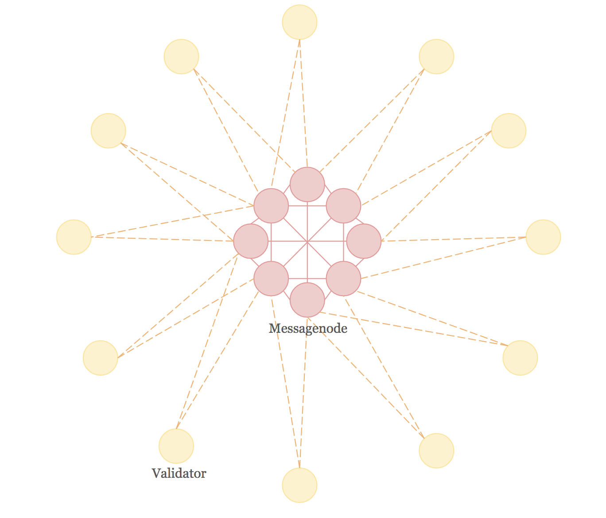
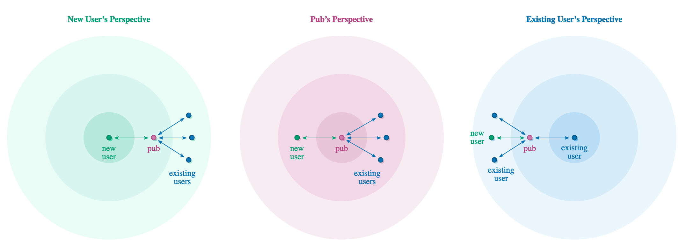
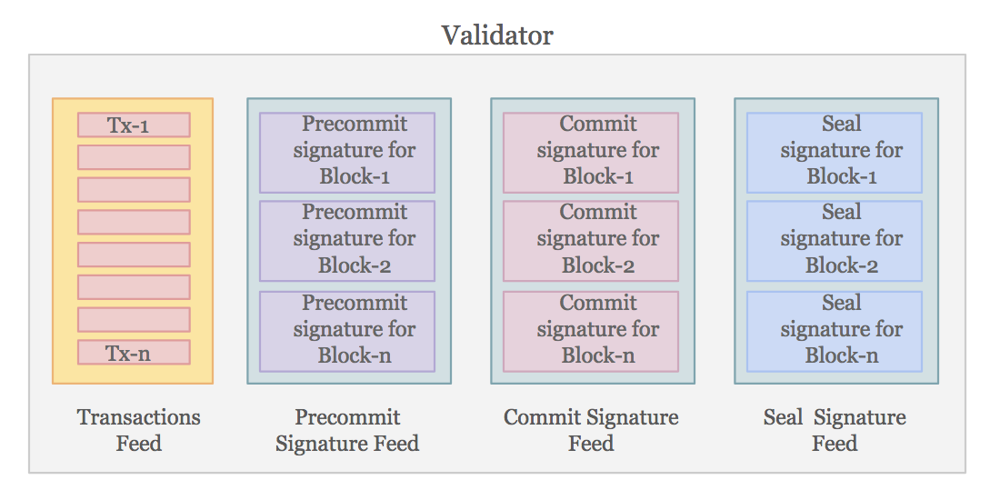
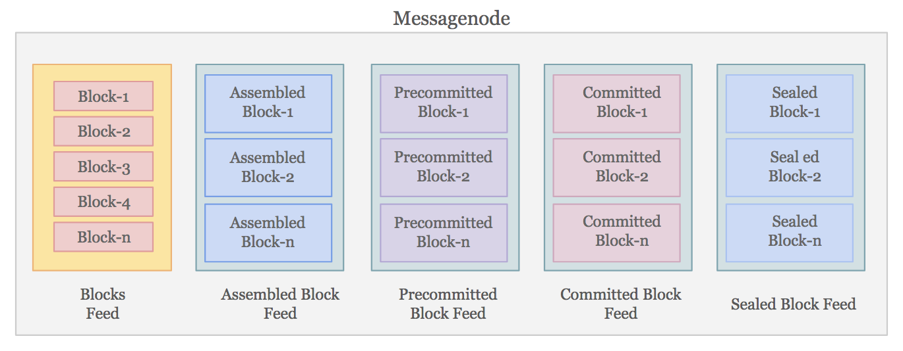

# BlockFin Peer-to-Peer Core and Data Model

## Introduction

This document describes the peer-to-peer (p2p) communication protocol between the validators and Messagenodes and between the Messagenodes themselves. BlockFin consists of a two-tier p2p network — a larger network of validators who receive transactions from clients, assemble them into blocks, and validate the blocks, and a second, smaller network of Messagenodes who provide storage interface to the validators. Both networks are p2p. We use the term, "node", to describe a validator or a Messagenode when the distinction is irrelevant. 

In order to participate in BlockFin consensus, the nodes need to deposit predefined number of STORE tokens as stake. They also need to provide KYC/AML information, which Storecoin validates. Once these requirements are met, nodes generate their identities in a private, secure environment. The identity consists of a secret key, public key pair. The nodes register their public keys with Storecoin such that all nodes know about each other’s existence. This is required because anyone can download the BlockFin consensus engine software, create secret key, public key pair, and join the network, but only staked and KYC/AML verified nodes can join the network as validators or Messagenodes. 

The remainder of this document describes how nodes communicate, authenticate that the messages exchanged are genuine, and the underlying data model itself.

## p2p communication

As described in the previous section, the nodes generate secret key, public key pair in a private, secure setting. The specifics of key generation is outside the scope of this document. The nodes use their respective secret keys to sign the messages they create, which can be verified by other nodes using the creators’ public keys. The identity of a node looks like follows. 

```
{

  "curve": "ed25519",

  "public": "s9+ZsrSDXz7WdQ6ED7Ry3+tN8tTzl3J0DEIuTn/tXrU=.ed25519",

  "private": "baTNPZd9Ta47Tp+a0gTpje3SK4iJ/yebaVrWH0749eiz35mytINfPtZ1DoQPtHLf603y1POXcnQMQi5Of+1etQ==.ed25519",

  "id": "@s9+ZsrSDXz7WdQ6ED7Ry3+tN8tTzl3J0DEIuTn/tXrU=.ed25519"

}
```

Listing 1 — The identity of a node in BlockFin

BlockFin’s communication core is built using [Secure Scuttlebutt](https://github.com/ssbc/secure-scuttlebutt) (SSBC). SSBC is a database of unforgeable append-only feeds, optimized for efficient replication for peer to peer protocols. BlockFin makes use of the following features offered by SSBC.

### Feed-based message exchange

The data model resembles feeds in a social network. This model, while unusual for a blockchain, has the following advantages.

* Each block in the blockchain and each subsection of a block (like, header, transaction block, signature block, etc.) can be modeled as a "feed". A feed is simply a thread of messages. For example, the “block header” of a block is a feed with header attributes as messages.

* The feeds can be "followed" by those who are interested in them. Validators for example, follow the “feed” of the block being assembled to get all the updates about the block. When the validators are done validating the block, they will “unfollow” the current block and move on to the next one. This approach keeps the design simple.

* The nodes can "follow" just the specific feeds they are interested in without having to drink from the firehose. The block itself may contain a lot more information such as audit logs, proofs, intermediate states, and so on, but not all of them are required all the time, so the nodes can choose to follow specific feeds for specific operations during block validation process.

* The feed metaphor results in loosely coupled design. Traditional blockchain data structures result in tight coupling and follow the general read/write pattern. The feed metaphor allows for publish/subscribe design pattern, which is superior in asynchronous environments. When needed, read operations can still be performed by specifically requesting for the messages of a given "type" in a feed.

* SSBC implements "offline-first" model. This is critical with unreliable network connectivity, which is typical when the nodes are distributed across the globe. The data is first persisted in the publishing node’s local store and is automatically synchronized to its “following” peers when connectivity is restored.

### Append-only design

SSBC feeds are append-only by design. There is no modify or delete constructs. So, a record (message) once inserted into the feed cannot be modified or deleted. This is important in trustless environments where adversaries could modify records to their advantage or delete ones that are not favorable to them. In addition, the append-only construct helps maintain the audit log of all the activities performed on a feed.

### Unforgeability

SSBC uses cryptographic signatures to ensure that the messages are unforgeable. A node cannot pretend to be some other node and insert messages for that node. With append-only design, this allows for strong consistency because a node cannot deny any wrongful operation. In addition, the messages are encrypted end to end to prevent man-in-the-middle attack. The following types of attacks are impossible with SSBC.

* The malicious node cannot create a new feed with the same identifier as another node

* The malicious node cannot write new fake messages to the feed

* The malicious node cannot reorder the messages in the feed

* The malicious node cannot send a new copy of the feed that omits messages from the middle

However, the malicious node *can* refuse to send callers the feed, or only send the first *N* messages in the feed. We will discuss how this can be addressed in a later section.

SSBC uses [libsodium](https://github.com/jedisct1/libsodium.js) for cryptographic primitives such as encryption, decryption, signatures, password hashing and more. The identity listed in listing 1 uses "[ed25519](http://ed25519.cr.yp.to/)" curve. The public and private (secret) keys used as described above. The id is same as the public key. As a notation, SSBC prefixes “@” for identities.

The identities of nodes (specifically, their secret keys) must be protected just like the private keys in the wallets. A stolen identity allows an adversary to assume the identity of the stolen node.

## Identity

Although we have two types of nodes in BlockFin — validators and Messagenodes — these nodes can assume different identities based on the role they play during block assembly and validation. The following roles are defined.

* **Empty block producer** — Messagenodes assume this role to create empty blocks in BlockFin blockchain. The empty blocks will be filled with transactions later as they arrive at validators. 

* **Transaction validator** — Validators assume this role when they receive transactions from clients. Once the validation succeeds, they queue the transactions locally for block assembly.

* **Block assembler** — Messagenodes assume this role to assemble transactions from all the validators and prepare the block for the 3-stage validation process. 

* **Precommitter** — Validators assume this role to run the precommit logic on the assembled blocks. At the end of the precommit stage, the validators sign the block with their decision.

* **Precommit counter** — Messagenodes assume this role to count the precommit signatures as the validators complete the precommit stage on the assembled blocks. Once sufficient number of signatures are collected for a block, the block is marked ready for commit stage.

* **Committer** — Validators assume this role to run the commit logic on the precommitted blocks. At the end of the commit stage, the validators sign the block with their decision.

* **Commit counter** — Messagenodes assume this role to count the commit signatures as the validators complete the commit stage on the precommitted blocks. Once sufficient number of signatures are collected for a block, the block is marked ready for sealing stage.

* **Sealer** — Validators assume this role to run the sealing logic on the committed blocks. At the end of the sealing stage, the validators sign the block with their decision.

* **Seal counter** — Messagenodes assume this role to count the sealing signatures as the validators complete the sealing stage on the committed blocks. Once sufficient number of signatures are collected for a block, the block is marked as sealed.

There may be other minor roles possible, which will be added as the need arises. Note how the same nodes assume different roles based on the task being performed. Each of these roles has an associated identity, so the nodes can sign with the assumed identities instead of their global identity as a validator or Messagenode. So, the signing protocol is, "Validator V signed *as Precommitter*" rather than “Validator V signed”. Listing 2 shows an example of role identity owned by a node. It is similar to listing 1, except for the “owerid” attribute, which identifies associated node who assumes this role (and hence identity) and “role”, which specifies the role this identity is tied to.

```
{

  "curve": "ed25519",

  "public": "@+G8+aSI7DGW/SZXvkEqX1ilx5L5B0GEnRQJu/sIS3Xk=.ed25519",

  "private": "uZBuCYVs1NeBUn6WC/kyJu1nAc64JSrQFK7+MA4nwej4bz5pIjsMZb9Jle+QSpfWKXHkvkHQYSdFAm7+whLdeQ==.ed25519",

  "id": "@+G8+aSI7DGW/SZXvkEqX1ilx5L5B0GEnRQJu/sIS3Xk=.ed25519",

  **"ownerid": "@s9+ZsrSDXz7WdQ6ED7Ry3+tN8tTzl3J0DEIuTn/tXrU=.ed25519",**

  **"role": "precommitter"**

}
```

Listing 2 — The identity of a role that the associated node assumes

The validators and Messagenodes register the public keys for the respective roles with Storecoin, so all the other nodes are aware of them. This information is signed by node’s global public key ("owerid") in order to authenticate the information shared. The nodes must protect all of these identities so others can’t assume these identities and perform malicious activities. The following terms are used for the reminder of this document.

* **Identify of node** — This is the global identity (public key) of a node as a validator or Messagenode.

* **Identify of role** — This is the identity of the assumed role of a node. This identity is tied to the global identity to allow for constructs such as "Validator V (global identity) signed *as Precommitter* (role identity)". 

## Feed

A feed is a sequence of signed messages. A feed is associated 1:1 with the identity. Feeds are similar to "topics" in a publish/subscribe system. The feeds are structured at the lowest level of granularity possible, so higher level structures can be composed of the messages from low-level feeds. Remember that the nodes assume multiple identities depending on the role they play during block assembly and validation process and hence a feed exists for each of these roles for a given node. For example, a validator would have a feed for all of its precommit messages, another feed for its commit messages, and so on.

Since the nodes are connected peer-to-peer, there is no central authority to create the feeds or decide which of the Messagenodes should host a particular feed. Note also that the nodes can lie. For example, a malicious node *can* refuse to send feed messages to other nodes selectively. So, any possibility of collusion or centralization must be prevented. We need a design, which achieves the following simple constructs.

* Validators create their own feed locally. When they have to create any messages (discussed below) they simply post to their own feeds. With this, each publishing validator maintains a local copy of the messages it is responsible for publishing.

* The Messagenodes subscribe to all validators. In other words, they "follow" validators. By following all validators, Messagenodes serve as feed aggregators.

* The Messagenodes have their own feeds. Unlike validators, whose feeds are all about themselves, the feeds from the Messagenodes are about aggregate state changes. Validators follow Messagenodes to learn about the aggregate state changes.

How are these constructs useful and how is this approach is superior to nodes gossipping among themselves like in traditional blockchains ? In BlockFin, validators are responsible for "individual" decisions. For example,

* Validators receive incoming transactions from clients and pre-validate them. After successful prevalidation, the transactions become eligible to be assembled into the next empty block.

* When it is their time to validate the blocks, the validators create signatures with their approval.

Both the above are individual decisions that each validator takes.

Messagenodes, on the other hand, take "aggregate" decisions. For example:

* Messagenodes decide when a block is "full" and is ready for validation. The transactions in the assembled block may have come from multiple validators.

* Messagenodes decide when sufficient validator signatures are collected for a given validation stage, so they can compute Merkle hash of the signatures.

Although each subnetwork is responsible for different sets of decisions, they are dependent on each other and they make decisions based on the information they collected while following each other. The following behaviors can be observed in this setup.

1. All Messagenodes take their aggregate decisions independent of other, based on their own following of validators. If validators misbehave by censoring feeds from certain Messagenodes or filtering messages, the Messagenodes would not take the same decisions. Since Messagenodes replicate among themselves any censoring or filtering behaviors will be nullified.

2. The Messagenodes themselves can censor or filter messages received by following the validators. But the messages are not lost because the validators are in fact the feed owners. So, any misbehavior from Messagenodes will also show up easily.

Because of this, not all the nodes need to store all the information like in traditional blockchains. The validators store only the data they produce in the form of their personal feeds. The Messagenodes produce their own aggregate feeds based on their subscription to validators’ feeds. Finally, validators consume the aggregate feeds in their decision process. This interdependency between the two subnetworks keeps both them honest. We’ll prove in a later section how malicious behaviors are impossible to hide.

### Messages

The feed consists of a series of messages. As discussed above, a feed is associated with an identity and hence the messages in the feed are scoped to the identity and are about the identity. A sample message is as shown in listing 3 below.

```
{

  "previous": "%26AC+gU0t74jRGVeDY013cVghlZRc0nfUAnMnutGGHM=.sha256",

  "author": "@+G8+aSI7DGW/SZXvkEqX1ilx5L5B0GEnRQJu/sIS3Xk=.ed25519",

  "sequence": 216,

  "timestamp": 1442590513298,

  "hash": "sha256",

  "content": {

    "type": "precommit",

    "data": {

      "link": "%WbQ4dq0m/zu5jxll9zUbe0iGmDOajCx1ZkLKjZ80JvI=.sha256",

      "blockid": 16456,

      "exceptions": [],

      . . .

    }

  },

  "signature": "Sjq1C3yiKdmi1TWvNqxIk1ZQBf4pPJYl0HHRDVf/xjm5tWJHBaW4kXo6mHPcUMbJYUtc03IvPwVqB+BMnBgmAQ==.sig.ed25519"

}
```

Listing 3 — A sample message in a feed

The messages in different feeds indicate different states or operations, but they all have familiar format as shown in listing 3.  Each message has the following attributes.

* previous — The hash of the previous message in the feed. This, by itself is fairly useless for any application level logic, but it ensures the integrity of the feed by linking the current message to the previous message in the feed.

* author — the public key of the identity, which created this message. 

* sequence and timestamp — obvious attributes. The timestamp is node’s local Unix time. There is no universal coordination of time across nodes.

* content — the message specific content. This is the only part that varies from feed to feed and models the exact content that the message is meant to capture. We’ll discuss feed specific content in later sections.

* signature — the signature of the entity identified by the author. This is what the makes the message unforgeable.

Having a uniform message design results in simpler implementation as message validation is common across all identity types. The loose coupling of messages in different feeds also result in simple and reusable implementation. 

## Following

The feeds are replicated via the concept of "following". SSBC has message [schemas](https://ssbc.github.io/ssb-msg-schemas/) defined for following. The message type, “contact” is used to determine the followers of a feed and the messages are automatically replicated to all the followers. Since the feeds are append-only, replication is very simple. There is no merging or conflict resolution required since all the operations are performed from the point of view of individual nodes. 

{ type: 'contact', contact: FeedLink, following: Bool, blocking: Bool }

## "CP" of CAP theorem

SSBC and by that extension, BlockFin prioritizes "C"onsistency over “A”vailability. The connection between nodes can be unreliable, so the rate of progress with block validation depends on the reliability of the network. The blockchain is never in an inconsistent state because some nodes are unreachable. Some blockchains prioritize availability over consistency. While this results in *progress* despite severe communication failures among participating nodes, prioritizing availability results in inconsistent blockchain state. BlockFin, on the other hands, sacrifices availability for consistency. When the communication is restored, the nodes are synchronized automatically and the block validation resumes the normal speed.

## Network Model

Fig. 1 below shows the network model of the BlockFin. For the sake of simplicity, only a representation of possible connections between the nodes is rendered in fig. 1. 



Fig.1 — Two-tier BlockFin network

As discussed earlier, BlockFin is constructed off a two-tier network. The larger network consists of validators and a smaller network, consisting of Messagenodes. Recall from earlier discussions that the validators and Messagenodes "follow" each other to learn about each others’ states. The communication between validators and Messagenodes is exclusively via the following mechanism. There is no reason or use for the validators to follow each other’s feeds. The Messagenodes are similarly follow validators to learn about individual operations performed by the validators. In addition, the Messagenodes also follow each other to learn about what other Messagenodes have learnt, so they can all reach the eventual consistency state as soon as possible. This also allows validators to follow just one or two Messagenodes to quickly learn about the aggregate states computed by the Messagenodes. Note that BlockFin consensus protocol doesn’t make any timing assumptions during block validation process and makes progress as long as sufficient number of signatures are collected for each stage of the validation. 

When a node follows another node, it automatically discovers other nodes, who are also following the same node. For example, when a validator follows a Messagenode, it automatically follows other Messagenodes which may be connected to that Messagenode. This is how nodes learn about network states quickly. See [SSBC protocol](https://ssbc.github.io/scuttlebutt-protocol-guide/) guide (scroll to "Pubs" section) on how nodes discover neighboring nodes, as they follow one of those nodes. Fig. 2 below is reproduced from SSBC documentation. The “user” here is “identity”, which we discussed in the previous sections.



Fig. 2 — SSBC node discovery

When a node connects to another node, it discovers all the other nodes connected to it. Similarly, the other nodes see the new node. They can then choose to follow each other, thus syncing the global state as quickly as possible. 

## Data Model

This section describe BlockFin data model for various messages exchanged between the nodes. Specifically, the "content" data structure described in listing 3 above. Recall from the previous discussions that a feed is produced from the point of view of the identity who owns it and hence the messages are similarly constructed to reflects the actions of those identities. This model is superior because it doesn’t require any conflict resolution or merging, so each identity can proceed independent of others. If the same information is received from multiple sources, the duplicates can simply be dropped confidently because each message is signed by the originator of the message, so it is easy to identify the duplicates.  Fig. 3 shows the feeds maintained by each of the validators.

 

Fig. 3 — Feeds maintained by the validators

Each validator creates 4 feeds, each of which is owned by the respective identities.

1. **Transaction feed** — The validator is responsible for receiving transactions from the clients. After the transaction validation succeeds, the validator publishes the transactions to the transactions feed. Notice that the validator doesn’t broadcast the transactions to other validators or Messagenodes, but simply pushes them to its transactions feed. Because of the way the feeds are designed in SSBC, each new transaction added to the feed is linked to previous transactions, thus forming unforgeable linked structure of all transactions received by the validator. The individual transactions may end up in different blocks, but at the source, this structure provides a sequence of transaction receipt at the validator.

2. **Precommit signature feed** — This feed maintains the precommit signatures created by the validator upon completing the precommit validation stage for an assembled block. We will show how the validator gets the assembled blocks later when we discuss feeds for Messagenodes. Each message in the feed contains the precommit signature for one block.

3. **Commit signature feed** — This feed maintains the commit signatures created by the validator upon completing the commit validation stage for a precommitted block. Functionally this is similar to precommit signature feed otherwise.

4. **Seal signature feed** — This feed maintains the sealing signatures created by the validator upon completing the sealing stage for a committed block. 

It can be observed that these feeds collectively represent the individual state of the validator. They automatically document what the validator has done. Since each message in the feed contains the sequence number and timestamp, it is easy to model the validator’s behaviors on a time series. For example, it is possible to know the average number of precommit validations performed per second, minute, or day. It is easy to find out if a validator missed validating a particular stage of a block, because the signature for that stage would be missing from the corresponding feed. 

The validator feeds don’t show the data from the perspective of the blockchain itself.  That happens with the Messagenodes as shown in fig. 4 below.



Fig. 4 — Feeds maintained by the Messagenodes

Messagenodes maintain the aggregate feed, which reflect the global states from the blockchain perspective. These feeds collectively make BlockFin blockchain. While the feeds don’t look anything like a traditional blockchain in their structure, they are linked to the appropriate blocks by way of the block identifiers and hashes. This results in greater block security because:

* each feed acts as a mini-blockchain by itself in its structure where one message links to its previous message. By design, this is unforgeable.

* Each message, in its "content" block contains links to other messages it is referring to, thus forming the secondary links. For example, a message in Precommitted Block Feed may include a link to the block in the Blocks Feed to indicate which block the precommitment belongs. Since the message itself is unforgeable, so will be links contained in them.

This double indirection model not only improves security but also keeps the contents loosely, but securely coupled. The feeds managed by Messagenodes are as follows.

1. **Blocks feed**  — This is the BlockFin blockchain itself. In order to preserve the structure and security of the blockchain, empty blocks are created at Storecoin launch with just header and some metadata information. Since each block is required to link to the previous block, all the way to the genesis block, creating the empty blockchain at launch preserves its structure. At any time in the future, new empty blocks can be added by any Messagenode as needed and other Messagenodes simply replicate them. This prevents history rewrite attack because it is impossible to inject new blocks in between or delete or modify the existing blocks. 

2. **Assembled block feed**  — This feed consists of assembled blocks, ready for validation. The Messagenodes follow the validators’ "Transaction feed" for the validated transactions from them and assemble them into the next empty block. Once a threshold capacity is reached (either a threshold number of transactions per block or a timeout) the block is marked as ready for validation. Each message in this feed contains a list of transactions for a given block referenced by the block identifier and hash from the Blocks feed. The validators will follow this feed to know when a block is ready for validation.

3. **Precommitted block feed**  — This feed consists of blocks that completed the precommit stage. The Messagenodes follow the validators’ "Precommit signature feed" for their precommit signatures on the assembled blocks. The Messagenodes count the precommit signatures as they are received. Once a threshold number of valid precommit signatures are received, the Messagenodes create a Merkle hash of all the precommit signatures and add that as an entry to this feed, signaling the completion of the precommit stage.

4. **Committed block feed**  — This feed consists of blocks that completed the commit stage and work similar to the Precommitted block feed. The Messagenodes follow validators’ "Commit signature feed" for their commit signatures.

5. **Sealed block feed**  — This feed consists of blocks that completed the sealing stage and work similar to the Precommitted and Committed block feeds. The Messagenodes follow validators’ "Seal signature feed" for their seal signatures.

Notice that each Messagenode makes its decisions locally based on the messages it receives from following the validator feeds. All honest Messagenodes thus come to the same conclusions. Since Messagenodes follow each other’s feeds, they learn about each other’s decisions as well. Any abnormalities in the decisions will be flagged. This approach where the nodes take local decisions but verify their decisions against others makes it hard to censor or filter information, because it will be noticed quickly by others in the network. 

## Global ordering of messages

BlockFin consensus algorithm doesn’t require global ordering of transactions like other traditional blockchains. The order of transactions in the block doesn’t matter, except for the purpose of computing Merkle tree of transactions. The Merkle root is used by individual Messagenodes to verify that their peers came to the same conclusion as them. It is in this context some ordering is required, so each Messagenode can individually compute the Merkle hash without having to collaborate/gossip with its peers. If this can be achieved, all honest Messagenodes can work independently of each other and yet come to the same conclusion. We are currently working on this problem and will update this section once we have the details.

  

