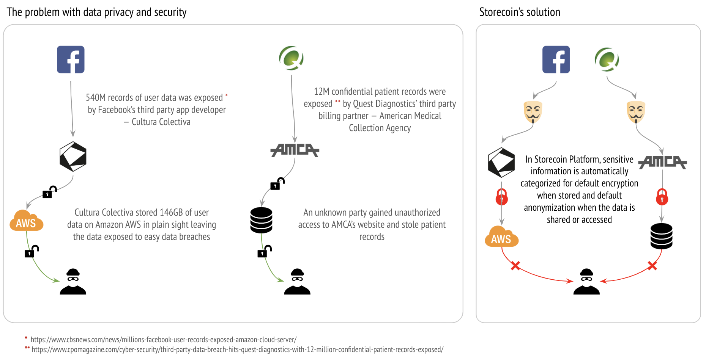
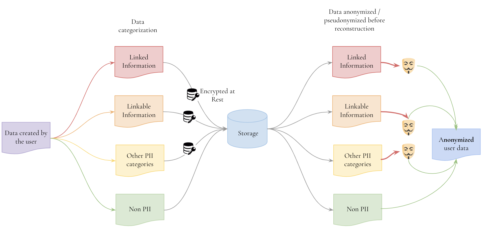
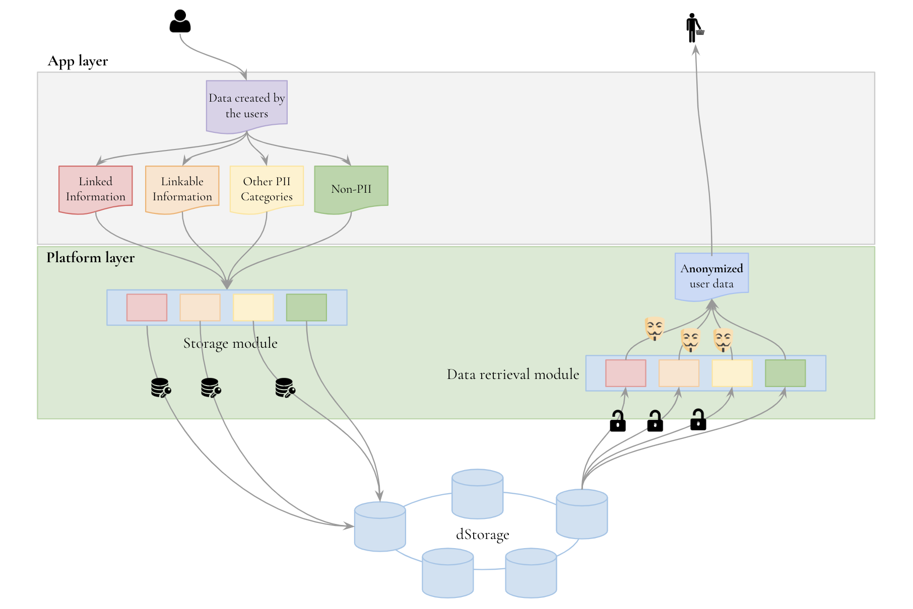

# De-identifying Private Data

## Introduction

This document discusses a design to de-identify Personally Identifiable Information or PII (NOTE:   We use the term PII to refer to any sensitive information whose privacy must be protected.). Storecoin Platform facilitates the decentralization of data into programmable money. The data created by the users of tokenized apps can be discovered, purchased, and used by any data buyer who is interested in the data. However, this poses a challenge when the data is PII: how to protect the privacy of the data and its creator even when that data is traded on the platform? One option is enforcing restrictions on trading such data, but that’s not practical as evidenced by ongoing data sharing and privacy violations [5] by prominent social networks, data exchanges, data brokers, and others. To date, our conversations about data privacy have been painted with too broad a brush stroke and have been generic to the point of irrelevance. When we ask questions about privacy and data, we need to ask what is the real threat to privacy that data trading represents. This leads us to personally identifiable information, which, if that's the case, means that our focus should be on de-identifying that data. Given this premise, a more practical approach would be to allow sharing or selling any information, including PII, but at the same time ensuring that the privacy of the data is protected. This document discusses an approach that involves de-identifying personally identifiable information, so PII can be shared without violating user’s privacy. De-identifying PII is the default setting in Storecoin Platform and supported out of the box.

## Overview

All eyes are on data. From the regular data breaches[14] that pepper the news to the growing consternation of politicians, data, privacy, and tech are at the center of modern consciousness. The data the increasingly monopolistic tech giants collect about users and their behaviors is the most valuable part of any digital application. Yet, the only benefit the users get in return is digital experience. 

On the other end of the spectrum, large enterprises such as banks and healthcare companies must safeguard their users’ data from data breaches even when that data leaves their infrastructure into their partners’. Recently, a massive data breach has struck Quest Diagnostics where an unauthorized user gained access to their billing partner, American Medical Collection Agency, leaving Quest off guard.

Strong privacy policies and regulations such as the EU’s GDPR (General Data Protection Regulation) are not sufficient to guard data privacy and protection. We live in an ad-supported economy where majority of services are offered free of charge, in exchange for allowing harnessing users’ data. This means, users pay for services they use with their privacy. So, the question becomes, is there an approach where even sensitive information can be traded while protecting the data privacy and security? We attempt to answer this question with the following illustration.



Protecting user’s privacy is hard because of different data security and retention policies among cooperating partners. Storecoin addresses this problem with:

* automatic identification and categorization of a default set of personally identifiable information

* automatic encryption of such sensitive information to protect against data theft, and

* automatic and context-sensitive anonymization of sensitive information to protect data privacy even when it is traded.

The rest of this document discusses Storecoin’s approach to de-identify sensitive information.

## What is PII?

PII is still emerging as a category of consideration, and as such does not have a single, universally accepted definition. That said, different bodies are rallying quickly to a definition similar to that provided by NIST [6:

PII is any information about an individual maintained by an agency, including (1) any information that can be used to distinguish or trace an individual‘s identity, such as name, social security number, date and place of birth, mother‘s maiden name, or biometric records; and (2) any other information that is linked or linkable to an individual, such as medical, educational, financial, and employment information. 

For the purposes of our approach at Storecoin, we divide PII into two categories [1]: linked information and linkable information.

### Linked information

Linked information is any piece of personal information that can be used to identify an individual and includes, but is not limited to, the following:

* Full name

* Home address

* Email address

* Social security number

* Passport number

* Driver’s license number

* Credit card numbers

* Date of birth

* Telephone number

* Log in details

### Linkable information

Linkable information, on the other hand, is information that on its own may not be able to identify a person, but when combined with another piece of information could identify, trace, or locate a person. Here are some examples of linkable information:

* First or last name (if common)

* Country, state, city, postcode

* Gender

* Race

* Non-specific age (e.g. 30-40 instead of 30)

* Job position and workplace

Some information like the following are generally not considered as PII, but their classification is a bit of a gray area. For example, GDPR [7]  treats cookies as PII, so depending on the data jurisdiction, such information may be freely shared or need to be anonymized.

* Device IDs

* IP addresses

* Cookies

While PII is broadly classified as linked and linkable information, this classification is not static and there is no universal legal definition (in the United States) that can be relied upon. This is because the privacy concerns are dependent on specific scenarios. For example, names and phone numbers of government officials are publicly known, so they don’t pose any privacy concerns. However, their personal mobile numbers need to be treated as PII. In a different scenario, all the 3 pieces of information may need to be treated PII and hence need to be protected. 

This document treats PII as a generic category, which implies the following:

1. The information needs to be encrypted at rest (in the storage medium.)

2. The information requires de-identification when accessed.

The specific ways the information is treated will be app and use case dependent as described in the example above. 

## Why PII is valuable?

Targeted advertisements, location-based services, etc. are legal reasons why PII is useful. In the illegal market, PII is valuable for counterfeiting identities for illegal activities. The remainder of this document assumes legal use of PII and how de-identifying it doesn’t affect its usefulness for the intended purposes. 

## What is de-identification?

De-identification [9] is the process used to prevent a per[son's identity](https://en.wikipedia.org/wiki/Personal_identity) from being connected with information. For example, data produced during human subject research might be de-identified to preserve research participants' privacy. De-identification is achieved by a combination of anonymization, pseudonymization, and encryption, depending on specific use cases. 

With de-identification, data privacy is ensured even after the data leaves Storecoin Platform boundaries into data buyer’s infrastructure. This eliminates data leaks like what happened with the Mexico-based media company Cultura Colectiva [10]. According to UpGuard, more than 540 million records with user information including comments, likes, reactions, names and Facebook IDs were exposed on the public internet through third-party data sets totaling 146 gigabytes. The files were stored on Amazon’s S3 cloud storage. Since Facebook shared user information with Cultura Colectiva without de-identification, it cannot ensure its users’ privacy when the data leaves its infrastructure.

## Anonymization and pseudonymization

Anonymization and pseudonymization [8] are two terms that are commonly used when data privacy is discussed. GDPR defines anonymization as the "data rendered anonymous in such a way that the data subject is not or no longer identifiable." When a piece of data is anonymized, it cannot be reconstructed to identify the person at a later time. 

Pseudonymization, on the other hand, is "the processing of personal data in such a way that the data can no longer be attributed to a specific data subject without the use of additional information." Unless pseudonymized data is somehow linked to PII, they do not expose any identifiable data. 

## How Storecoin Platform achieves de-identification?

In order to de-identify PII, the platform needs to identity PII among the data created by app users. Not all parts of the data created by app users are PII, so the platform must devise a way to identify private data. This is done with *data* *categorization*. The user created data is categorized for various types of PII, so the platform knows how to treat such information. Since the tokenized app knows its data best, the data categorization is done in the app layer.

## Data categorization

Storecoin Platform defines various *categories* to which the app data can belong. The data categories are well published in order to allow them to be discovered. App developers can use existing data categories, subclass from them, or define new categories depending on their needs. The categorization makes anonymization and pseudonymization possible. A sample schema for data categorization is shown in listing 1. The attributes related to categorization are highlighted in listing 1.

```
{

"appId": “<Unique ID of the app>”,

"version": “<App version>”,

"dataVersion": “<Version of the data”>,

**# Available data categories from this app.**

"**dataCategories**": [

#These categories are common across tokenized apps. The data categories

#and data classes (described below) have similar definitions because they

#describe the data fields available in the app.

"**category1**": {

#For example, "**PII**".

"fields": {

**# Data fields available in this app for the category.**

"**field1**": {

"**type**": “String”,

"**default**": “<Any default values>”,

. . .

},

. . .

},

"**example**": “<Optional. A URL showing an example of this data>”,

. . . .

},

"category2": {

. . .

},

"category3": {

. . .

},

. . .

],

#Available data classes for this app. The classes describe the data access tiers

#with different payment requirements.

"dataClasses": [

# These classes are app-specific. 

"basic": {

"fields": {

# Field definitions, so the consumer knows what they mean.

"field1": {

"type": “String”,

"default": “<Any default values>”,

. . .

},

. . .

},

#The price can be per unit of data or as continuous basis such as monthly 

#access.

"price": <Price per unit of the data>,

"subscriptionPrice": <Subscription price, if this is what the app wants>,

"subscriptionDuration": <WEEKLY|MONTHLY|ETC.>,

"example": “<Maybe URL to an example of this data>”,

. . . .

},

"silver": {

. . .

},

"gold": {

. . .

},

. . .

]

}
```

Listing 1 — Schema for data categorization

## Data categorization guidelines[12]

Data categorization is done based on the security objective of the app. The security objective may be related to confidentiality of information, integrity, or availability. The following table describes different levels of security objectives to achieve the necessary level of confidentiality, integrity, or availability.

<table>
  <tr>
    <td>Security Objective</td>
    <td>Low</td>
    <td>Medium</td>
    <td>High</td>
  </tr>
  <tr>
    <td>Confidentiality
Preserving authorized restrictions on information access and disclosure, including means for protecting personal privacy and proprietary information.</td>
    <td>The unauthorized disclosure of information could be expected to have a limited adverse effect on organizational operations, organizational ./assets, or individuals.</td>
    <td>The unauthorized disclosure of information could be expected to have a serious adverse effect on organizational operations, organizational ./assets, or individuals.</td>
    <td>The unauthorized disclosure of information could be expected to have a severe or catastrophic adverse effect on organizational operations, organizational ./assets, or individuals.</td>
  </tr>
  <tr>
    <td>Integrity
Guarding against improper information modification or destruction, and includes ensuring information non-repudiation and authenticity.</td>
    <td>The unauthorized modification or destruction of information could be expected to have a limited adverse effect on organizational operations, organizational ./assets, or individuals.</td>
    <td>The unauthorized modification or destruction of information could be expected to have a serious adverse effect on organizational operations, organizational ./assets, or individuals.</td>
    <td>The unauthorized modification or destruction of information could be expected to have a severe or catastrophic adverse effect on organizational operations, organizational ./assets, or individuals.</td>
  </tr>
  <tr>
    <td>Availability
Ensuring timely and reliable access to and use of information.</td>
    <td>The disruption of access to or use of information or an information system could be expected to have a limited adverse effect on organizational operations, organizational ./assets, or individuals.</td>
    <td>The disruption of access to or use of information or an information system could be expected to have a serious adverse effect on organizational operations, organizational ./assets, or individuals.</td>
    <td>The disruption of access to or use of information or an information system could be expected to have a severe or catastrophic adverse effect on organizational operations, organizational ./assets, or individuals.</td>
  </tr>
</table>


Once the security objective is defined for the app, data categorization can be done to meet the defined objective. The following is a sample subset of predefined categories.

1. Authentication verifiers — Passwords, shared secrets, cryptographic private keys, etc. On Storecoin Platform this category of data is seldom discovered, shared, or traded. See *Shareable vs Private Information* section below for more details about this category of information.

2. Financial information — Bank account details, credit card information, brokerage details, etc.

3. Electronic Protected Health Information (EPHI) — Health information of the user.

4. Federal tax information

5. Payment card information

6. PII discussed above

7. Education records

8. Controlled technical information — This category of information is related to organizations rather than people. This includes proprietary business and sales data, engineering data, etc.

## Anonymization schemes

Not all PII are anonymized with the same approach. The following schemes are used to anonymize various data.

### Directory Replacement (DR)

In this method certain fields, like name, are mapped to fictitious values based on a directory of values. It is important that the original value (such as name = LeBron James) always maps to a deterministic mapped value (like, name = Koharu Ito). The mapping cannot be random. The advantage of this approach is its deterministic behavior, so the *value* of the data is not lost due to anonymization. The downside is that directory lookup is expensive and so is maintaining the sanity of the directory.

### Scrambling (S)

Scrambling involves obfuscating the information. In this case, the translated value may be indecipherable depending on the scrambling techniques used. For example, if social security number is scrambled by hashing it with SHA256, the resulting hash is indecipherable.

### Masking (M)

In masking, the sensitive information is masked by a replacement character. For example, a social security number, 555-55-5555 can be masked variously as 555-xx-xxxx, ***-**-****, and so on.

### Contextualized anonymization 

In some cases, generic anonymization using any of the above approaches may be unacceptable. For example, if directory replacement approach is used to anonymize the name, the mapped name may have to be culturally sensitive. For example, if the original name is "Anand Ramanathan" the mapped name cannot be “Mikhail Kuznetsov”. So, a contextualized anonymization scheme must be provided in order to customize the default behavior.

### Blurring (B)

This is a variation of the masking technique where part or full field is blurred. It is also used to blur certain areas of images (like face in a close up photo).

The linked information listed previously are anonymized as follows. This is not a complete list, but serves as an example of how different schemes are applied for various data. Note that different apps may choose to anonymize the same data differently.

* Full name — DR, M, B

* Home address — S, M, B

* Email address — S, M, B

* Social security number — M, B

* Passport number — M, B

* Driver’s license number — M, B

* Credit card numbers — M, B

* Date of birth — M, B

* Telephone number — S, M, B

* Login details — S, M, B

## Pseudonymization schemes

Pseudonymization uses some of the same schemes as anonymization. Pseudonymization classification is data related, not scheme related. The following examples show the appropriate schemes for pseudonymization.

* First or last name (if common) — DR, M, B

* Country, state, city, postcode — S, M, B

* Gender — probably none.

* Race — probably none.

* Non-specific age (e.g. 30-40 instead of 30) — probably none.

* Job position and workplace — S, M, B

* Device IDs — S, M, B

* IP addresses — S, M, B

* Cookies — S, M, B

Fig. 1 shows the data categorization flow on the *write* path and anonymization/pseudonymization flow on the read path. Data, identified as PII is also encrypted at rest.



Fig. 1 — Data categorization before persistence and anonymization when requested

The data produced by the app user is likely split into many PII categories depending on the data produced by the user. So, a single *record* produced by the user may result in multiple *sub-records*, depending on the categories of PII the record is split into. This process ensures that appropriate de-identification methodologies are applied on the sub-records when a request is made for the data. Depending on the use case, sub-records may be totally anonymized or with sufficient pseudonymization to help with re-identification later. 

In certain uses cases anonymization and pseudonymization are not desirable. For example, if the app generates credit reports for loan applicants, anonymization and pseudonymization are undesired. Such apps can make an exception to turn off anonymization engine altogether. Storecoin Platform may flag such apps as not protecting data privacy (even though for legitimate reasons) so the users are aware of such apps.

## Encryption

In addition to anonymization and pseudonymization, PII and other sensitive data is encrypted at rest (in the storage medium) to combat hacking or access from insiders with superuser privileges. Data categorization helps in this respect also. The design for encrypting PII and other sensitive information is outside the scope of this document, but we acknowledge that encryption is necessary to ensure the privacy and security of user’s data. Just like de-identification, encryption is turned on by default on Storecoin Platform for PII, so it is safe from hackers even if they manage to get hold of the encrypted data.

## Re-identification

Sometimes, the use cases dictate re-identification of the user after an analysis is done on the de-identified information. For example, after a diagnosis is made by an outside expert, the patient in a hospital, which shared the de-identified information with the expert, needs to identify the patient to proceed with the recommended procedure. So, if the data were totally anonymized, re-identification would not be possible. So, de-identification is a spectrum — strong anonymization prevents re-identification and ensures data privacy throughout the data chain and a combination of anonymization and pseudonymization helps with re-identification depending on the degree of re-identification required.

Storecoin’s de-identification schemes discussed above allow app developers to determine whether a certain scheme exposes the data for re-identification. They can run the PII produced by their apps through various schemes discussed above and determine the degree of re-identification with those schemes. This helps with tightening the privacy without accidentally exposing PII unintentionally.

## Shareable vs private information

Not all data in the platform are shareable. Certain classes of data are sensitive in nature and they are never shared. Passwords, keys, signatures, and all *control* information belong to this category. Their sensitivity is handled in the platform by not categorizing them. In other words, only categorized information can be discovered and traded or shared. The control data can be encrypted or protected by other means as needed.

The *system* data in the blockchain is similarly not tradable, although they are not hidden like the control data. This data includes, audit logs, block reward details, bonuses paid to dWorkers, etc. which are also maintained on-chain. These data are not categorized either because they are not tradable. The system data are accessible via well-published APIs by anyone and hence they are outside the scope of tradable data.

## Enforcing anonymization

Who enforces anonymization in Storecoin Platform? Is it just a guideline that app developers are expected to follow or the platform enforces anonymization of PII data? Fig. 2 answers these questions.



Fig. 2 — Automatic enforcement of data anonymization 

As discussed previously, data anonymization is enabled by default in Storecoin Platform. The anonymization process requires that app developers categorize the data produced by app users. The categorized data is persisted by the Storecoin Platform layer as per the rules associated with different categories. For PII for example, data is encrypted at rest as shown in fig. 2. 

When a query is made to the data (the details of which are not shown in fig. 2 to minimize unnecessary details) by data buyers, the data is anonymized automatically in the platform layer, before the reconstructed user data is returned to the buyers.

As discussed previously, apps in which the anonymization is not desired, automatic anonymization can be turned off. However, such apps are flagged as *not preserving data privacy* by the platform, even though there are legitimate reasons for doing so. 

## Use cases [11]

### Use case 1 — privacy preservation while still providing researchers with the necessary data

*A national government project in central Europe was seeking to identify prisons that had populations that were at high risk for outbreaks of certain disease so that they could intervene. They found that certain lifestyle traits, specifically a history of intravenous drug usage, piercings, and tattoos, had a high positive correlation with this disease. This lifestyle information was not codified and only existed in free form text notes. Their first solution was to manually mask or blur the records and supply the remaining information to the researchers. But it failed to achieve privacy objectives. Specific prisoners could often be identified. Their second solution was to use manual free form text data mining tools to extract only certain keywords, removing the entire record, and only supplying those keywords and the prison location. This proved successful. Their current plan is to use automated tools to identify key phrases, transform those into project-specific codified values, and then only supply that information along with the prison identifier to the researchers. *

### Analysis

* *This lifestyle information was not codified and only existed in free form text notes *— This poses a threat to the privacy of prison inmates, if the data is ever stolen. In Storecoin Platform, the lifestyle information is categorized as a form of PII and hence it is encrypted at rest.

* *Their first solution was to manually mask or blur the records and supply the remaining information to the researchers  *— This is pseudonymization. While some information is hidden from the researchers, they are still able to re-identify the inmates based on the information shared with them. Storecoin allows app developers determine the exposure for re-identification, so they can ensure the right exposure without unintentionally exposing private information.

* *to extract only certain keywords, removing the entire record, and only supplying those keywords and the prison location. This proved successful  *— This is a combination of anonymization and pseudonymization, with a right balance to expose just the right amount of information. Storecoin allows developers to run the data produced in their apps through various (combination of) de-identification schemes to learn how they can balance right exposure of user’s data.

* *Their current plan is to use automated tools to identify key phrases, transform those into project-specific codified values, and then only supply that information along with the prison identifier to the researchers *— The project-specific codification uses contextualized anonymization. The prison identifier allows the officials to re-identify the inmates to proceed with the recommendations made by the researchers. Both of these are facilitated in Storecoin Platform.

### Example

The following table shows an example of this use case on Storecoin Platform. It compares the prisoner information before and after de-identification. The data in JSON format is used for simplicity. De-identification can work for data in any format. The specific scheme used for de-identifying each data field is described inline below.

<table>
  <tr>
    <td>Prisoner information in clear text</td>
    <td>Prisoner information after de-identification</td>
  </tr>
  <tr>
    <td>
        
```
        {
prison_id: "<ID of prison location>",
prisoner_id: “<ID of the prisoner>”,
name: “<Name of the prisoner>”,
gender: “<male/female>”,
age: <age>,
race: “<Race of the prisoner>”,
lifestyle_info: “<sexual orientation,
drug usage, tattoos,
piercings, etc.>”,
# Other information about the prisoner.
. . .
}

```
</td>
    <td>
    
```        {
# prison ID is retained as is.
prison_id: “<ID of prison location>”,

#Directory replacement (DR) is used.
#This helps with identifying the prisoner
#later if needed.
prisoner_id: “<Mapped ID>”,

#Name is masked. It could have been
#removed as well.
name: “**********”,

#Gender is retained since researchers
#may need that information. However, 
#this information could be masked if
#for example, there was only one 
#female prisoner in this prison location,
#which identifies her indirectly. So,
#we can use contextualized anonymization
#(CA) also here. 


gender: “<male/female>”,

#DR is used to provide a range for the
#age. 

age: <age low-high range>,

#CA is used to ensure that identity 
#cannot be inferred through this
#information. So, this field can either 
#be retained or masked.

race: “<Retained or masked>”,

#CA and DR are used. CA is used to 
#extract key phrases and DR is used to 
#codify the key phrases. For example:
#Sexual orientation:  
#00 - Straight
#01 - LGBT
#02 - etc.
#Drug usage:
#00 - clean
#01 - Name of the drug used.
#02 - etc.

#Except for mapped key phrases, all other
#information is removed. They are shown
#as masked below for clarity.
lifestyle_info: “<**** 01, *****
** 07, **** 03,
00 **** , etc.>”,

#Other information is similarly 
#de-identified.
. . .
}
```
</td>
  </tr>
</table>


### Use case 2 — clinical trial

*A clinical trial is being planned that will involve independent reviewers of patient records to *

*assess the response to an experimental drug. It may be necessary to inform patients of unusual findings. The trial sponsors set up a trial manager that will receive information from the physicians. The trial sponsor will perform the de-identification of the records, substituting clinical trial IDs for the original identifiers, obscuring dates, and redacting other non-clinical information. They chose to use a trial manager rather than ask the various patient physicians to perform de-identification based on the complexity of the trial requirements. The patients, physicians, and the trial sponsor agreed to allow a de-identification team access to the original patient data. The de-identification team and their systems are kept separate from the clinical trial results analysis. Only the de-identification team knows the relationship between clinical trial IDs and patient IDs. *

*In the event that a significant finding is made by the review team, they communicate the finding to the de-identification team. The de-identification team contacts the patient’s physician with the *

*finding. The patient’s physician examines the record and communicates with the patient. The physician informs the de-identification team that the patient has been informed. The de- identification team informs the review team, so that the review team can confirm that their ethical duty to ensure that the patient is informed has been met. *

### Analysis

This example involves 5 parties.

1. Drug manufacturer who wants to perform a clinical trial for an experimental drug.

2. Independent reviewers, who conduct the review of the experimental drug on a set of patients.

3. Patients who participate in the clinical trial.

4. Physicians who oversee informing the patients of any unusual findings.

5. A trial manager who mediates between independent reviewers and physicians.

In this case, we have patient information on one side and trial results on the other side. Parties 1 and 2 are prohibited from identifying the patients directly and parties 3 and 4 are prohibited from accessing the trial data. Trial manager is made responsible for de-identifying the patient information with the ability to re-identify them if needed.

* *substituting clinical trial IDs for the original identifiers, obscuring dates, and redacting other non-clinical information  *— Original identifier substitution uses directory replacement approach with contextualized anonymization, so trial IDs can be customized for this particular clinical trial. The directory replacement allows for retrieving patient ID back when the patient needs to be communicated. Obscuring dates and redaction use masking and blurring.

* Use of a trial manager demonstrates a process where a third party may be used for protecting the data produced by the two sides of the trial from each other.

* In order for physicians to inform the patients about unusual findings, re-identification is necessary. In this case, the trial data for the affected patient is made available without revealing the trial ID to the physicians.

* This use case demonstrates cooperation among multiple parties where their respective private data are de-identified and yet, they can perform their responsibilities without losing data precision.

### Example

In this use case, there are two sets of data that need to be de-identified — the patient information and trial data. The patient information is de-identified before sharing it with the trial researchers and similarly the trial data is de-identified before sharing it with physicians. 

<table>
  <tr>
    <td>Patient information in clear text</td>
    <td>Patient information after de-identification</td>
  </tr>
  <tr>
    <td>
        
```        
        {
hospital_id: "<ID of the hospital>",
physician_id: “<ID of the physician>”,
patient_id: “<ID of the patient>”,
name: “<Name of the patient>”,
gender: “<male/female>”,
age: <age>,
weight: <weight>,
insurance_info: {
<Insurance provider
details>,
},
health_info: {
<medical information such
as prescriptions, medical
conditions, test results,
prior surgeries, allergies,
etc.>
},

payment_info: {
<Payment information such
as credit card/bank details,
etc.>
},
#Other information about the patient.
. . .
}
```
</td>
    
<td>
    
```
    {
# Hospital ID is retained as is.
hospital_id: “<ID of the hospital>”,

#DR is used to protect the identify.
#It is also used to re-identify the
#physician, if they need to be contacted 
#with the unusual findings about the
#patient.
physician_id: “<ID of the physician>”,

#DR is used to protect the identify.
#It is also used to re-identify the
#patient, if they need to be contacted 
#with the unusual findings about them.
patient_id: “<ID of the patient>”,

#Masked. It could be removed as well.
name: “******”,
#Retained as is. This may be crucial 
#for the trial.
gender: “<male/female>”,

#DR with a range.
age: <age low-high range>,

#Retained as-is.
weight: <weight>,

#Removed.
insurance_info: {
<Insurance provider
details>,
},

#CA, DR, and Masking are used.
#CA is used to extract only the 
#information that is needed for the 
#trial.
#DR is used map the required medical
#information to codify what the trial
#needs.
#Masking is used to mask unwanted 
#information. Such data could be removed
#as well if it is safe to do so.
health_info: {
. . .
},

#Removed. This information is not needed.
payment_info: {
<Payment information such
as credit card/bank details,
etc.>
},
#Other information about the patient.
. . .
}
```
</td>
  </tr>
</table>


The trial data is similarly de-identified to protect the identify of the researchers, any confidential information about the trial itself, etc. before sharing that information with the physicians.

### Use case 3 — Sharing PII with publishers and ad-exchange system

*There's been a whole lot of "implied consent" going on for some time now when it comes to collecting and sharing PII. That's because the online ad exchange system is flooded with players at different levels. There are not only the "publishers", selling advertising space based on user's personal data to “advertisers” hungry to get in front of the right eyeballs, but there are all sorts of third parties in between, brokering deals between advertisers and publishers. And once the information on whose eyeballs are up for sale goes out into the ad exchange ecosystem, there's no way to control the leakage of that data to numerous other parties. Even the advertisers who don't win the bid for the advertising space available still have some amount of access to the data they were invited to bid on, otherwise, how would they know if they wanted to buy those "eyeballs"? And that data is then used to update user profiles in various databases across the industry.** *

*The central issue is data privacy "leak" as user’s data propagates through multiple players in the ad exchange ecosystem. How this leak can be prevented in the light of the EU's General Data Protection Regulation (GDPR)? There's even more concern industry-wide with the to-be-finalized ePrivacy Regulation, which is still being negotiated by EU government, but which threatens to place an even heavier emphasis on consent for legal processing of personal data, casting a wider net than the GDPR.*

### Analysis

This use case illustrates complexity of protecting user’s privacy even with regulations such as the EU’s GDPR. Since most services on the internet are either free or discounted because of the ad revenue, sharing PII will continue despite the regulations. The need for explicit consent from users for data collection has destroyed user experience by presenting users with an unceasing set of permissions that don’t actually help with protecting their privacy. 

* *Once the information on whose eyeballs are up for sale goes out into the ad exchange ecosystem, there's no way to control the leakage of that data to numerous other parties — *user data is shared among different players in the ad exchange ecosystem, so conformance to GDPR and other regulations is not sufficient. Data retention policies may be different with different players and may change over time, so there is no easy way to "take back" sensitive information after it is shared.

* *And that data is then used to update user profiles in various databases across the industry — *the curated and linked data across multiple players is never deleted or unlinked, thus posing greater risk to user’s privacy. A piece of potentially useless data (such as a vacation photo) may become a privacy hazard if it is combined with the information from other players (such as name, address, income, etc.) because now the person in the photo can be identified definitively. 

* *The central issue is data privacy "leak" as user’s data propagates through multiple players in the ad exchange ecosystem — *the privacy leak may be unintended and the cooperating partners may not even be aware of this leak, so preventing new leaks and stopping any existing leaks are nearly impossible.

This use case demonstrates that regulations will not entirely prevent privacy leaks. What’s more, the cost of complying with them makes it unfair for smaller players who cannot bear that cost, resulting in large players becoming larger.

### Example

The following example illustrates how de-identification prevents privacy leaks and yet, serves the needs of all the players in the ecosystem. For simplicity, the de-identified information is shown between a pair of cooperating partners, but the same process exists between all partners. It can also be noted that once a user’s information is de-identified at one level further de-identification is unnecessary. 

For simplicity, the user information is shown to be collected by one publisher. In practice, the information may have been gathered by multiple players. In any case, as long as de-identification process is followed between the partners, privacy leaks can be prevented. 

This example also shows that multiple strategies exist for de-identification based on the need for sharing the information.

<table>
  <tr>
    <td>User information in clear text
(at a publisher, who collects this information)</td>
    <td>User information after de-identification</td>
  </tr>
  <tr>
    <td>

```        
        {
name: "<Name of the user>",
address: “<address of the user>”,
contact_info: {
<phone numbers,
email addresses,
social network accounts,
linkedin, etc.>
},
gender: “<male/female>”,
age: <age>,
SSN: “<National ID>”,
drivers_id: “<Government issued ID>”,
credit_card_info: {
<credit cards with
expiry dates, etc.>
},
financial_info: {
<Bank accounts, 
brokerage accounts,
401K, etc.>,
},
health_info: {
<medical information such
as prescriptions, medical
conditions, health risks,
etc.>
},
work_info: {
<Companies worked for,
salary information,
titles, etc.>
},
online_info: {
<IP addresses, cookies,
devices, history of sites
visited, search history,
etc.>
},
# Other information about the user.
. . .
}
```
</td>
    <td>

```
    {
#Masked, blurred, or DR’d depending on 
#the need. If there is a need for 
#re-identifying the user, DR is used.

name: “<Name of the user>”,

#Masked, blurred, or DR’d depending on 
#the need.

address: “<address of the user>”,

#Masked, blurred, or DR’d depending on 
#the need.

contact_info: {
<phone numbers,
email addresses,
social network accounts,
linkedin, etc.>
},
#Can be shared as is.
gender: “<male/female>”,

#DR’d with an age range.
age: <age low-high range>,

#Masked, or blurred.
SSN: “<National ID>”,

#Masked, or blurred.
drivers_id: “<Government issued ID>”,

#Masked, blurred, or removed. However,
#it is also possible to share “codified”
#information about credit worthiness
#of the user also. If that’s required
#a CA is used for computing the score,
#for example.
credit_card_info: {
<credit cards with
expiry dates, etc.>
},


#Same as credit_card_info above.
financial_info: {
<Bank accounts, 
brokerage accounts,
401K, etc.>,
},

#Masked, blurred, or removed. However,
#it is also possible to share “codified”
#information about the health score
#of the user also. If that’s required
#a CA is used for computing the 
#health score, for example.

health_info: {
<medical information such
as prescriptions, medical
conditions, health risks,
etc.>
},

#Same as health_score above.
work_info: {
<Companies worked for,
salary information,
titles, etc.>
},

#May be shared as is.
online_info: {
<IP addresses, cookies,
devices, history of sites
visited, search history,
etc.>
},
#Other information about the user.
. . .
}
```
</td>
  </tr>
</table>


The use cases discussed in this section touch different domains and different data types, but it can be observed that de-identification, especially when used with contextualized anonymization, can address data privacy adequately in all cases. So, this approach can be used safely even when PII is shared. Coupled with encryption, the privacy of the users of Storecoin Platform will be protected at rest as well as when their information is shared. 

### Use case 4 — Data aggregation and consumer privacy in Fintech [13]

*WASHINGTON — Federal regulators gathered Wednesday to discuss the fintech chartering process and some of the biggest challenges deterring the emerging industry from entering the banking space. *

*During the event, which covered a lot of ground beyond fintech, Treasury Secretary Steven Mnuchin and McWilliams agreed that they need to address data aggregation at banks and how consumers control their own data, as the FDIC is beginning to study the issue.*

*Federal Deposit Insurance Corp. Chairman Jelena McWilliams and Controller of the Currency Joseph Otting*

*Otting said separately that there was agency consensus on modernizing the law, revisiting CRA assessment areas and determining how lending data is being collected, for example.*

*McWilliams said the FDIC has begun studying data aggregation and how data is shared between banks and third parties, including with fintech vendors.*

*"We need to take a look at this," she said, clarifying it would be a “truly preliminary” study, not a rulemaking. “There are privacy concerns and cyber concerns. And from the FDIC’s perspective, the third-party vendor management is crucial."*

*Specifically, McWilliams said the FDIC is looking at who owns the data between parties as well as how much consumers have a right to their own data and whether more data should be shared. *

*Earlier in the day, McWilliams interviewed the Treasury's Mnuchin, who said that data aggregation was a critical matter but one that ought to be addressed through the private sector.*

*"This is a complicated issue and I would say my view from a consumer standpoint is, it should be very clear and very simple if your data is being shared, who it’s being shared with," Mnuchin said. “In general, I like where there are private solutions as opposed to a government **solutions**.” *

### Analysis

* *… need to address data aggregation at banks and how consumers control their own data **— *this use case presents a scenario in which data aggregation among cooperating banks and their partners is inevitable and yet, consumers can somehow control their own data without sacrificing their privacy. Should this be addressed with regulations or can technology help with solving this issue?

* *FDIC has begun studying data aggregation and how data is shared between banks and third parties, including with fintech vendors **— *data aggregation is necessary to provide personalized and differentiated services to customers, but how can the banks ensure that the privacy of their users is not sacrificed when they share the data with their partners?

* *There are privacy concerns and cyber concerns. And from the FDIC’s perspective, the third-party vendor management is crucial **— *the privacy concerns arise from the fact that the banks and their partners may have completely different data retention and privacy policies, so banks don’t have much control when the data leaves their system. The cyber concerns arise from the fact that any sensitive information may not be encrypted end to end in the partner chain, thus exposing user data in the weakest link of the chain. Vendor management is needed to ensure that these policies are aligned throughout the chain, but it is very hard to achieve given the dynamic nature of the participants in the chain.

* *FDIC is looking at who owns the data between parties as well as how much consumers have a right to their own data and whether more data should be shared **— *data ownership after it leaves one partner to another in the chain is hard to define, given ever changing policies on data encryption, retention, and privacy. Is there a better solution that is agnostic to individual partner’s privacy policies?

* *from a consumer standpoint is, it should be very clear and very simple if your data is being shared, who it’s being shared with **— *data sharing is opaque in today’s system. Consumers don’t have where some of their personal information is originated and who have access to that information? How can consumers be confident that their privacy is not compromised by others in the data aggregation chain?

### Example

The following example addresses the concerns raised above with de-identification and encryption. Any bank, which collects consumer data (*source* of data collection) encrypts the PII by default. This addresses cyber concerns discussed above. The data aggregation between banks and partners makes use of de-identification *— *specifically contextualized anonymization *—* so even PII can be shared between the partners without sacrificing user privacy and quality of data aggregation. The example illustrates how de-identification prevents privacy leaks and yet, serves the needs of all the players in the ecosystem. For simplicity, the de-identified information is shown between a pair of cooperating partners, but the same process exists between all partners. It can also be noted that once a user’s information is de-identified at one level further de-identification is unnecessary. 

For simplicity, the user information is shown to be collected by one bank. In practice, the information, full or in part, may have been gathered by one or more banks or their partners. In any case, as long as de-identification process is followed between the partners, privacy leaks can be prevented. 

This example also shows that multiple strategies exist for de-identification based on the need for sharing the information.

<table>
  <tr>
    <td>User information in clear text
(at a bank, who collects this information)</td>
    <td>User information after de-identification</td>
  </tr>
  <tr>
    <td>

```        
        {
name: "<Name of the consumer>",
address: “<address of the consumer>”,
contact_info: {
<phone numbers,
email addresses, etc.>
},
gender: “<male/female>”,
marital_status: “<married/single/widow(er)/
 etc>”,
age: <age>,
SSN: “<National ID>”,
drivers_id: “<Government issued ID>”,
income: <annual income>,
job_title “<job title>”,

#The following data are created by 
#this bank about this consumer.

financial_info: {
<
Bank account number, 
account type,
account balance,
transactions,
credit standing,
payment history,
etc.
>,
},

#Other information about the consumer.
. . .
}
```
</td>
<td>
    
```
    {
# Masked, blurred, or DR’d depending on 
# the need. If there is a need for 
# re-identifying the user, DR is used.

name: “<Name of the consumer>”,

#Masked, blurred, or DR’d depending on 
#the need.

address: “<address of the consumer>”,

#Masked, blurred, or DR’d depending on 
#the need.

contact_info: {
<phone numbers,
email addresses, etc.>
},
#Can be shared as is. But can be 
#Masked or blurred also.
gender: “<male/female>”,

#Can be shared as is. But can be 
#Masked or blurred also.
marital_status: “<married/single/widow(er)/
 etc>”,

#DR’d with an age range.
age: <age low-high range>,

#Masked, or blurred.
SSN: “<National ID>”,

#Masked, or blurred.
drivers_id: “<Government issued ID>”,

#DR’d with an income range.
income: <income low-high range>,

#Can be shared as is. But can be 
#Masked or blurred also.
job_title “<job title>”,

#Individual fields are de-identified
#differently.
financial_info: {
<
#Masked, blurred, or DR’d
Bank account number, 
#Probably shared as-is.
account type,
#DR’d with a range
account balance range,
#Removed or Masked
transactions,
#Probably shared as-is.
credit standing,
#Probably shared as-is
payment history,
etc.
>,
},

#Other information about the consumer.
. . .
}
```
</td>
  </tr>
</table>


The de-identification strategy used depends on whether re-identification of the consumer is required at a later date. Notice also that multiple strategies can be used depending on specific use cases, so no generalized and regid strategies are needed. For example, the data for a specific consumer may use a completely different set of de-identification strategies from another consumer. 

Since the information is de-identified, privacy and data retention policies of the partner don’t matter as the information cannot be used by the partner to identify the consumer directly. At the same time, data aggregation goals are achieved without losing accuracy. If the partner later produces aggregated information and shares them back with the bank, it can choose to de-identify certain data to protect its own privacy.

## Summary

* Prohibiting sharing/selling PII is not practical. But at the same time Storecoin Platform cannot ignore data privacy.

* Data privacy is ensured via de-identification. First, Storecoin Platform allows app developers categorize the app data, so any PII can be identified as such. Once a piece of data is identified as PII, it is automatically encrypted at rest and de-identified when the data is requested.

* Anonymization and pseudonymization are turned on by default. This means, data privacy is turned on by default. An app can however, turn off this default behavior if its use cases demand that. Such apps are flagged as not protecting user’s privacy by Storecoin Platform, so that the users are well informed.

* Apps can use different anonymization techniques depending on the data. The same data may be anonymized differently by different apps depending on their customer base. Even within a given app, the data may be de-identified differently based on the request types and use cases.

* Not all information in the platform can be shared or traded. Certain *control* information are sensitive in nature and their access is protected by not categorizing them. Only categorized data can be discovered and traded.

## References

1. https://piwik.pro/blog/what-is-pii-personal-data/

2. https://www.experian.com/blogs/ask-experian/what-is-personally-identifiable-information/

3. http://www.ncsl.org/research/telecommunications-and-information-technology/data-disposal-laws.aspx

4. https://www.ftc.gov/system/files/documents/public_events/1223263/p155407privacyconmislove_1.pdf

5. http://fortune.com/2018/03/23/facebook-data-scandal-carolyn-everson/

6. http://www.nist.gov/

7. https://eugdpr.org/

8. https://iapp.org/news/a/looking-to-comply-with-gdpr-heres-a-primer-on-anonymization-and-pseudonymization/

9. https://en.wikipedia.org/wiki/De-identification

10. https://www.adweek.com/digital/security-firm-finds-millions-of-facebook-data-files-were-stored-on-amazons-public-cloud-servers/

11. http://ihe.net/uploadedFiles/Documents/ITI/IHE_ITI_Handbook_De-Identification_Rev1.1_2014-06-06.pdf

12. https://www.cmu.edu/iso/governance/guidelines/data-classification.html

13. https://www.americanbanker.com/list/fintech-charters-cra-and-data-sharing-fdics-mcwilliams-occs-otting-weigh-in

14. https://en.wikipedia.org/wiki/Data_breach

